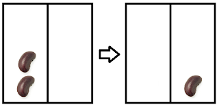
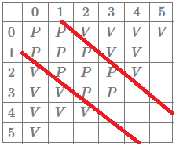

Este artigo contém a minha solução proposta para o [Problema #006 - pilhas de feijões][prob]. Por favor não leias esta solução se ainda não tentaste resolver [o problema][prob] a sério.

===

### Solução

Vamos mostrar que o João (isto é, o segundo jogador) tem uma estratégia vencedora. Em vez de apresentar apenas a prova de que o João consegue ganhar sempre, vou tentar recriar todo o meu raciocínio que levou a esta conclusão.

Representamos o número de feijões nos montes por um par $(x, y)$. A primeira coisa óbvia a notar é que as jogadas que se podem fazer em $(x, y)$ também se podem fazer em $(y, x)$, portanto tudo o que concluírmos sobre a posição $(x, y)$ aplica-se à posição $(y, x)$ e vice-versa. Agora começamos por notar que, se for a nossa vez de jogar, e estivermos em alguma das posições $(0, 0)$, $(1, 0)$, $(0, 1)$ e $(1, 1)$ perdemos imediatamente... O que quer dizer que o nosso objetivo é estar numa posição qualquer e jogar de modo a que o nosso adversário passe a estar numa das quatro posições anteriores. De onde é que podem surgir essas jogadas?

Notamos que é impossível chegar à jogada $(0, 0)$, já que em cada jogada tiramos feijões de um monte e pomos feijões noutro, portanto há sempre um monte de feijões que tem mais do que $0$ feijões. E como é que podemos chegar a $(1, 0)$? É fácil de ver que só a posição $(0, 2)$ pode dar origem à posição $(1, 0)$, da maneira representada pela figura seguinte:

De modo semelhante, podemos concluir que para chegar à posição $(1, 1)$ temos de ter vindo da posição $(3, 0)$ (ou da posição $(0, 3)$, claro). Neste momento já sabemos qual é o resultado de um jogo, jogado por dois jogadores perfeitos, que comece numa das posições $(0, 0)$, $(1, 0)$, $(0, 1)$, $(2, 0)$, $(0, 2)$, $(3, 0)$ e $(0, 3)$. Vamos continuar este tipo de raciocínio e sistematizar as nossas conclusões numa tabela. Dizemos que uma posição é perdedora $P$ se, num jogo começado nessa posição, o primeiro jogador perde. De modo semelhante, dizemos que uma posição é vencedora $V$ se, num jogo começado nessa posição, o primeiro jogador vence. Por exemplo, a posição $(1, 0)$ é $P$. O que sabemos até agora é o seguinte:

$$\begin{array}{|c|c|c|c|c|c|c|}
\hline & 0 & 1 & 2 & 3 & 4 & 5 \\
\hline
 0 & P & P & V & V & & \\
\hline 1 &  P & P & & & & \\
\hline
 2 &  V &  & & & & \\
\hline 3 & V & & & & & \\
\hline 4 &  &  & & & & \\
\hline 5 &  & & & & & \\
\hline
\end{array}$$

Continuamos a preencher a tabela, concluindo com alguma facilidade que as posições $(2, 1)$ e $(2, 2)$ são perdedoras. De seguida, podemos concluir que as posições $(3, 1)$, $(4, 0)$, $(4, 1)$, $(5, 0)$, $(6, 0)$ e $(4, 2)$ são vencedoras, porque todas elas podem chegar a $(2, 1)$ ou $(2, 2)$. Note-se que para uma posição ser vencedora basta que **uma** jogada sobre essa posição leve a uma posição perdedora. Por exemplo, na posição $(4, 0)$ podemos passar para $(2, 1)$ ou $(2, 0)$. Se passarmos para $(2, 1)$ ganhamos, porque $(2, 1)$ é uma posição $P$, mas se passarmos para $(2, 0)$ acabámos de dar a vitória ao nosso adversário.

Por outro lado, para uma posição ser perdedora é necessário que **todas** as jogadas a partir dessa posição dêem a vitória ao adversário, i.e. o jogador $A$ só está numa posição $P$ se, independentemente do que fizer, o jogador $B$ ficar numa posição $V$.

Preenchendo a tabela com as nossas novas conclusões, obtemos

$$\begin{array}{|c|c|c|c|c|c|c|}
\hline & 0 & 1 & 2 & 3 & 4 & 5 \\
\hline
 0 & P & P & V & V & V & V \\
\hline 1 &  P & P & P & V & V & \\
\hline
 2 &  V & P & P & & V & \\
\hline 3 & V & V & & & & \\
\hline 4 & V  & V & V & & & \\
\hline 5 & V  & & & & & \\
\hline
\end{array}$$

Neste ponto podemos começar a notar que um certo padrão parece emergir, que evidencio na tabela seguinte:

Neste momento podemos ser levados a conjeturar que as posições perdedoras são as posições da forma $(x, x+1)$, $(x, x)$ e $(x+1, x)$.

Antes de testarmos essa hipótese vamos ainda preencher as posições $(3, 2)$, $(3, 3)$ e $(2, 3)$. Se estas também forem posições $P$ então a nossa conjetura ganha ainda mais relevância.

De facto, notamos que estando na posição $(3, 2)$ apenas conseguimos ir para $(1, 3)$ e $(4, 0)$, que são duas posições $V$. Deste modo, $(3, 2)$ (e $(2, 3)$) é uma posição $P$. De modo análogo temos que $(3, 3)$ é $P$:

Poderíamos continuar a preencher a tabela, mas neste ponto já vale a pena tentar provar a nossa conjetura; não porque temos a certeza absoluta de que ela é verdade, mas porque se não for, somos capazes de compreender melhor que outro tipo de posições também são posições $P$.

**Conjetura**: Uma posição $(x,y)$ é uma posição $P$ se e só se $y \in \{x-1, x, x+1\}$. Isto é, toda a posição $P$ é da forma $(x,x-1),(x,x)$ ou $(x,x+1)$ e toda a posição dessa forma é uma posição $P$.

Começamos por provar que todas as posições da forma anterior são perdedoras, por indução no tamanho da primeira pilha. O caso base é para as posições $(1,0), (1,1)$ e $(1,2)$, que é trivialmente verdade pela tabela que já construímos. Supomos agora que as posições $(k,k-1), (k,k)$ e $(k,k+1)$ são todas perdedoras, para $k < x, x>1$, e mostramos que isso implica que as três posições $(x,x-1), (x,x), (x,x+1)$ são perdedoras também; para tal, verificaremos que, independentemente da jogada feita a partir dessas posições, o adversário consegue sempre jogar de maneira tal que voltamos a estar numa das posições na zona a vermelho. Relembramos ainda que o caso $(x, x-1)$ é dado de graça pela hipótese de indução, uma vez que $(x, x-1) \approx (x-1, x) = (k, k+1), k=x-1$ é uma posição perdedora pela hipótese de indução.

Note-se que, se da posição $(x, y)$ pudémos fazer a jogada $(x - 2n, y + n)$, então assumindo que $y + n \geq 2n$ podemos fazer a jogada $(x - 2n, y+n) \to ((x-2n) + n, (y+n) - 2n) = (x - n, y - n)$, i.e. mantemos a diferença entre os tamanhos das pilhas ($(x-n)-(y-n) = x-y$) mas diminuimos o tamanho total das pilhas. Basta agora notar que tanto no caso $(x,x)$ como no caso $(x,x+1)$ podemos fazer sempre a segunda jogada descrita anteriormente. Explanamos o raciocínio para a posição $(x, x+1)$: o primeiro jogador leva-nos para a posição $(x - 2n, x + n + 1)$ ou para a posição $(x + n, x - 2n + 1)$.

Estando no caso $(x - 2n, x + n + 1)$, é óbvio que podemos retirar $2n$ da segunda pilha: se pudemos retirar $2n$ feijões de uma pilha com $x$ feijões, então podemos retirar $2n$ feijões de uma pilha com $x + n + 1$, e ficamos na posição $(x - n, x + 1 - n)$ que, pela hipótese de indução, é perdedora. Se estivermos no caso $(x + n, x - 2n + 1)$ temos necessariamente que $2n \leq x + 1 \implies n \leq \frac{x+1}{2}$ uma vez que $x-2n+1\geq 0$. Ora $x + n \leq 2n \iff x \leq n \iff \frac{x}{2} \leq \frac{n}{2} \implies \frac{x+1}{2} \leq \frac{n+1}{2} = \frac{n}{2} + \frac{1}{2} \leq \frac{n}{2} + \frac{n}{2} = n$ e portanto podemos fazer a jogada $(x - 2n, x + n + 1) \to (x - n, x + 1 - n)$ que, pela hipótese de indução, é uma posição perdedora.

Concluímos assim que todas as posições da forma $(x, x-1), (x,x), (x, x+1)$ são posições perdedoras. Para mostrarmos que todas as posições perdedoras são desta forma, basta mostrar que qualquer outra posição é uma posição vencedora; de facto, se estamos na posição $(x, y)$ com $x > y+1$ então há um $n \geq 1$ tal que $(x - 2n, y + n)$ é de uma das formas anteriores (em particular tomando $n = \lfloor \frac{x-y}{3}\rfloor$).

De facto, se $x > y + 1$ então $x - y = 3n \vee x - y = 3n-1 \vee x - y = 3n + 1$ para algum $n \geq 1$. Fazendo uma jogada com esse mesmo $n$ na maior pilha dá o pretendido.

Conluímos assim a prova da nossa conjetura, e aplicando ao jogo do enunciado, notamos que a posição inicial é uma posição perdedora, i.e. o João tem uma estratégia vencedora se seguir a estratégia evidenciada pelo nosso raciocínio.

Na consola abaixo podem experimentar jogar contra o computador que, sempre que possível, vai adotar a estratégia vencedora. Para jogar basta carregar no triângulo por cima do código, para que este seja executado. Fazer uma jogada corresponde a dizer quais são os tamanhos com que as pilhas ficam depois de retirarmos os $2n$ feijões de uma das pilhas e posto $n$ na outra.

<iframe allowfullscreen="true" allowtransparency="true" frameborder="no" height="400px" sandbox="allow-forms allow-pointer-lock allow-popups allow-same-origin allow-scripts allow-modals" scrolling="no" src="https://repl.it/@RojerGS/PerfectStackedBeans?lite=true" width="100%"></iframe>

Se tens alguma questão sobre a minha solução, se encontraste algum erro (woops!) ou se gostavas de partilhar a *tua* solução, deixa um comentário em baixo.

[prob]: ../../{{ page.slug }}
