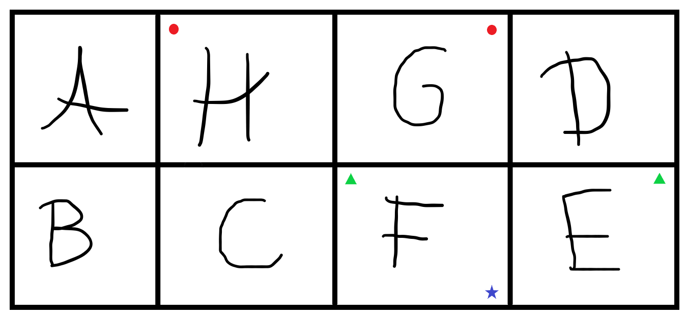
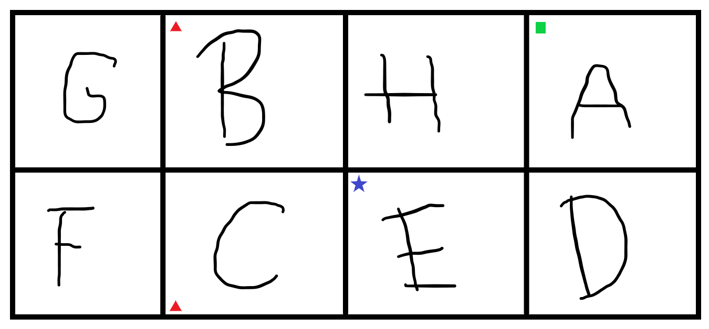

Este artigo contém a minha solução proposta para o [Problema #000 - ][prob]. Por favor não leias esta solução se ainda não tentaste resolver [o problema][prob] a sério.

===

### Solução

#### Nível 1

Para este nível basta dobrar a folha ao longo do eixo horizontal e depois dobrar o retângulo que obtemos como se fosse uma concertina.

#### Nível 2

Esta solução é bastante mais difícil de explicar por palavras portanto fiz um boneco da folha com umas marcas especiais:

Agora vira a folha ao contrário, porque também vais precisar destas marcas:

O processo é o seguinte:

 1. dobra o papel ao longo do eixo vertical para que os dois círculos vermelhos (nas letras `H` e `G`) se toquem. Agarra o papel pelas letras `H` e `G`;
   
 2. dobra o papel ao longo do eixo horizontal para que os dois quadrados amarelos (nas letras `G` e `F`) se toquem. Agarra o papel pelas letras `H` e `C`;
 3. procura as duas estrelas azuis (nas letras `F` e `H`) e agarra o papel pelas estrelas, com o teu indicador e com o polegar. Os dedos devem estar mesmo a tocar nas marcas para que tenhas _precisamente_ três camadas de papel entre os dedos;
 4. pega nas letras `E` e `D` e dobra-as, por dentro da dobra que estás a manter, para que os triângulos verdes se toquem;
 5. faz a dobra final para que o `B` vá para cima do `C`.

_Voilà!_

#### Nível 3

Na minha opinião, este é mais fácil de perceber como se faz _mas_ é bem mais difícil de conseguir fazer sem destruir a folha de papel... Vamos a isso!

Vamos começar com algumas marcas:

E no lado de trás também:

Agora faz-se assim:

 1. dobra ao longo do vinco vertical mais à esquerda para que os dois círculos amarelos (em `A` e `H`) se toquem;
 2. dobra de novo a partir do lado esquerdo, para que os quadrados verdes (o quadrado no `A` acabou de ficar à vista) se toquem;
 3. dobra ao longo do eixo horizontal para que os triângulos vermelhos (em `B` e `C`) se toquem;
 4. dobra da direita para a esquerda para que as estrelas azuis (em `E` e `F`) se toquem.

E é isto! _Quase_. Agora vem a parte difícil... Se olhares com atenção, está tudo bem exceto que o `H` está na ponta errada, a tapar o `A` em vez de vir a seguir ao `G`. Precisamos de passar o `H` para baixo, e a maneira como se faz isso é virando o papel de dentro para fora, como se estivéssemos a dobrar uma meia (parecido com o que acontece no [minuto 3:44 deste vídeo](https://youtu.be/124L94hoBQg?t=224))...

Eu precisei de um par de tentativas para conseguir fazer este; é perfeitamente natural que a tua folha de papel se rasgue um pouco... Na verdade, olha o que me aconteceu à primeira tentativa:

O `H` quase que foi completamente rasgado da folha!

Se tens alguma questão sobre a minha solução, se encontraste algum erro (woops!) ou se gostavas de partilhar a *tua* solução, deixa um comentário em baixo... Ou um vídeo?

[prob]: ../../{{ page.slug }}
