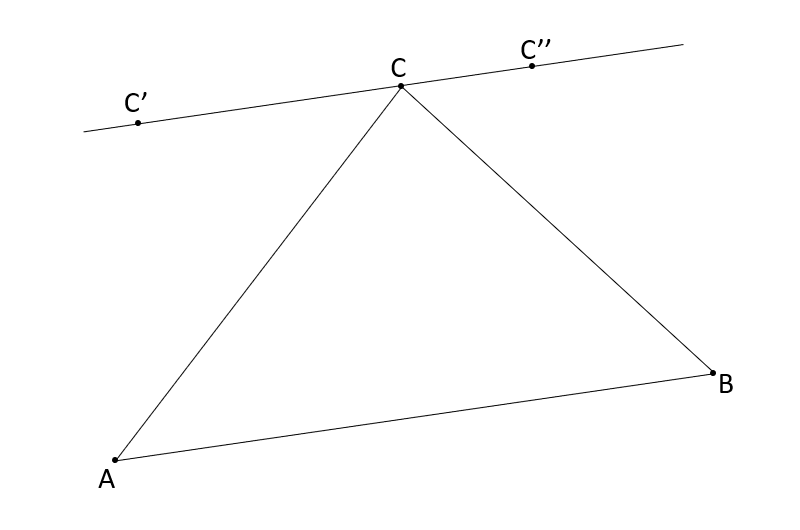

O formato deste artigo vai ser um pouco diferente do que tenho feito até agora, e vai ser a primeira de várias publicações nestes moldes: vou introduzir um pequeno problema _"de matemática"_ e depois vou partilhar uma possível solução.

===

### Enunciado do problema

Seja $[ABC]$ um triângulo qualquer. Vamos agora definir uma transformação que podemos aplicar ao triângulo, e que tem como efeito mover um dos vértices do triângulo e deixar os outros dois vértices fixos. Para aplicar a transformação, há que começar por escolher o vértice que se vai mover (vamos supor que queremos mover o vértice $C$). Agora consideramos a linha reta que passa por $C$ e que é paralela a $[AB]$ e escolhemos um ponto $C'$ nessa reta. O nosso triângulo passa a ser $[ABC']$. Esta transformação pode ser aplicada quantas vezes quisermos, aos vértices que quisermos. 
Será que há alguma maneira de, com esta transformação, fazer com que o nosso triângulo cresça e os lados fiquem todos com o dobro do tamanho? Como/porquê?

!!! Pensa um pouco...

Se precisares de clarificar alguma coisa, não hesites em perguntar na secção de comentários em baixo.

### Solução

Podes encontrar a minha proposta de solução [aqui][sol], para confirmares a tua resposta.

[sol]: ../s/{{ page.slug }}
