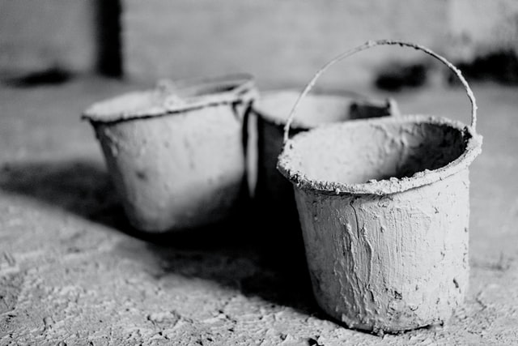

---
metadata:
    description: This blog post contains a problem related to the riddle of the water buckets and a setting in which it is impossible to solve.
title: "Problem #004 - solvability of the water buckets"
---

In [this previous post][wbr post] I talked about the riddle of the water buckets. Now I challenge you to prove that in some situations it is _impossible_ to solve it!

===

### Problem statement

You have $n$ buckets, each bucket with capacity for $c_i$ litres of water, $i = 1, \cdots, n$. You want to manipulate the buckets in such a way that one of them holds exactly $t$ litres of water, knowing that the only moves you can do are:

 - completely fill up bucket $i$ so that it holds $c_i$ litres of water;
 - completely empty bucket $i$ so that it now holds $0$ litres of water;
 - move water from bucket $i$ to bucket $j$, until bucket $i$ becomes empty or bucket $j$ becomes full, whatever happens first.

Prove that, if $t$ is not a multiple of the greatest common divisor of the $c_i$, $i = 1, \cdots, n$ then this is impossible to achieve.

For example, if the buckets have capacities $4$ and $6$ and $t = 3$, then you can't perform the moves above to get exactly $3$ litres of water into one of the two buckets as the greatest commond divisor of $4$ and $6$ is $\gcd(4, 6) = 2$ and $3$ is _not_ a multiple of $2$.

!!! Give it some thought... and give it an actual shot! Take out a piece of paper and a pencil and get your brain working!

### Solution

A possible solution is to consider a clever invariant that applies to the amount of water that each bucket is holding at any point in time. To make this easier, let's call $d$ to the greatest common divisor of the $c_i$, $i = 1, \cdots, n$ ($d = \gcd(c_1, \cdots, c_n)$). Let's also say the amount of water in bucket $i$ is $w_i$. We will show that, regardless of the moves we make, $w_i$ is _always_ a multiple of $d$ for all $i$ (which we write $d | w_i$ for _"$d$ divides $w_i$"_).

At the start all buckets are empty, so $w_1 = \cdots = w_n = 0$ and $0$ is a multiple of $d$ so that is that. Now we show that the three moves above preserve this property that $d | w_i\ \forall i$.

 - Emptying bucket $i$: this means $w_i = 0$ and $d | 0$ so everything is good;
 - Filling bucket $i$: this means $w_i = c_i$ but, by definition, $d$ is _a_ divisor of $c_i$ so certainly we have $d | c_i$;
 - Moving water from bucket $i$ to bucket $j$ until either bucket $i$ becomes empty or bucket $j$ becomes full, whatever happens first: before we move water around we have that $d | w_i$, $d | w_j$ so we can say that $w_i = k_i d$ and $w_j = k_j d$ for some integer values of $k_i, k_j$. Now when we start moving the water, we have to analyze what happens depending on whether bucket $i$ becomes empty and $j$ is not full yet or bucket $j$ becomes full while $i$ possibly has some water left:
   - if bucket $i$ becomes empty then $w_i = 0$ and $w_j = (k_i d) + (k_j d) = (k_i + k_j) d$; $d | 0$ and $d | (k_i + k_j) d$ so everything stays a multiple of $d$;
   - if bucket $j$ got full, then $w_j = c_j$ and $d | c_j$, so this is ok; we just need to check if the amount of water left in bucket $i$ is a multiple of $d$ or not. Well, bucket $j$ had $k_j d$ water and now has $c_j$, so bucket $i$ gave $c_j - k_j d$ water to bucket $j$. If bucket $i$ _had_ $k_i d$ water it now has $w_i = k_i d - (c_j - k_j d)$. But this is still a multiple of $d$ because $c_j$ was! We can write $c_j = k d$ with $k$ integer, showing that $w_i = k_i d - (c_j - k_j d) = d(k_i - k + k_j)$ _is_ a multiple of $d$!

We showed that no matter what we do, the amount of water in a bucket is always a multiple of $d$, so if $t$ is _not_ a multiple of $d$ this means we can never have a single bucket holding $t$ litres of water...

What do you make of this solution? Did you come up with something different? Let me know in the comment section below.

[wbr post]: ../../water-buckets