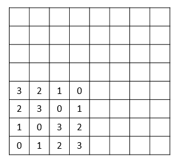
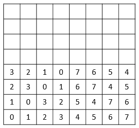
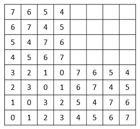
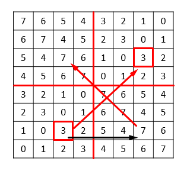

---
metadata:
    description: This blog post concerns a really interesting problem that takes place on an infinite board!
title: 'Problem #005: number me right'
---

This post's problem is a really interesting problem I solved two times. The first time I solved it I failed to prove exactly how it works... then some years later I remembered the problem statement and was able to solve it properly. Let's see how you do!

===

### Problem statement

Take a chessboard and extend it indefinitely upwards and to the right. In the bottom leftmost corner you put a $0$. For every other cell, you insert the smallest non-negative integer that hasn't been used neither in the same row, to the left of the cell, nor in the same column, below it. So, for example, the first row will have the numbers $0, 1, 2, 3, \cdots $. What is the number that appears in the $1997$th row, $2018$th column?

!!! Give it some thought... my best advice would be for you to create a grid in your piece of paper and start filling it out as stated by the rules. Can you find a pattern?

### Solution

The key here is to understand the way in which the board is filled. When I first solved the problem I started by filling a board on my own, to get a feel for the rules imposed. Doing so should make clear that, for example,

 - the number in the diagonal is always a $0$;
 - the board is symmetric along the diagonal, i.e. the number in column $j$ and row $i$ is the same number as in row $j$ and column $i$.

The interested reader is left with trying to get a feel for the pattern involved in filling the board. We skip right to the full solution.

**Claim:** the number in the $i+1$th row and $j+1$th column is $i \hat{} j$, where $\hat{}$ is the bitwise [XOR] operation.

The bitwise XOR takes two bit representations and for each pair of corresponding bits returns $1$ if one and only one of the bits was $1$. Otherwise the result is $0$. For example, $1100_2 \hat{} 1010_2 = 0110_2$.

Notice how this aligns with the two observations made:

 - the diagonal only has zeros; in the diagonal the row $i$ and column $j$ are the same, $i = j$ and $x \hat{} x = 0$;
 - being in row $i$ and column $j$ is the same as being in column $i$ and row $j$; $x \hat{} y = y \hat{} x$.

From now on we will renumber the rows and columns so that they start at $0$ and we will let $c(i,j)$ be the value in the $i$th row, $j$th column. Let $P(n)$ be the statement "the bottom left square of the table with side $2^n$ has, in every row, every single number from $0$ to $2^n -1$ and $\forall i,j \leq 2^n-1: c(i,j) = i \hat{} j$. This final part means that the value of a specific cell is calculated with the XOR operation.

We will prove this by induction. The statement $P(0)$ is trivially true as the square with side $2^0 = 1$ is just the square with the number $0$ that the problem statement fills in for us, and $c(0,0) = 0 \hat{} 0 = 0$.

Assume $P(n)$ is true. We show this implies that $P(n+1)$ is also true.

In the image above, we exemplify with $P(2)$ already filled in. Now we will show that we can fill the whole square in the image by following the same rule (i.e. using bitwise XOR) and we show that every row will hold the numbers $0, 1, \cdots, 6, 7$. To make things easier for everyone, let's say the big square in the image is split into four smaller squares; the $SW$ square is already filled in and on top of it is the $NW$ square. To the right of the $SW$ square is the $SE$ square and in the top right corner of the big $8 \times 8$ square is the $4 \times 4$ square we will call $NE$.

We start by filling in the $SE$ square of size $2^n$, the one to the right of the square already filled (the $4 \times 4$ on the bottom right in the image). In every row, all numbers from $0$ to $2^n - 1$ have been used, so it should be fairly easy to see that the numbering on that square is going to be exactly the same as in the square $SW$, except that we need to sum $2^n$ to each cell. We just need to check that the rule to compute the values still remains valid. Let $0 \leq i < 2^n$ and $0 \leq j < 2^n$. Then $(i, 2^n+j)$ gives valid coordinates for a cell in the bottom right square of size $2^n$ and

\[i \hat{} (2^n + j) = 2^n +  (i \hat{} j) = 2^n + c(i,j)\]

which is exactly the value we assigned to the cell $(i, 2^n + j)$. The reason why $i \hat{} (2^n + j) = 2^n + (i \hat{} j)$ is because $i < 2^n$. Just note that $2^n + j$ starts with a $1$ in binary, while $i$ has to start with a $0$ if we are to force the binary representations of $2^n + j$ and $i$ to have the same number of digits.

This leaves us at:

Symmetry gives that the $NW$ square of size $2^n$ is exactly the same as the $SE$ square we just created and showing that the XOR rule still works is completely analogous to what we just did, which will leave us at

So now we are left with understanding how the $NE$ corner is filled in. Both to the left (in $NW$) and below it (in $SE$) all numbers from $2^n$ to $2^{n+1}-1$ have been used, so in each row and in each column we can still freely use any number from $0$ to $2^n - 1$. But that is exactly the same as if we were to fill the $SW$ corner of the board, hence squares $NE$ and $SW$ are the same. Now let $0 \leq i, j < 2^n$. Then $(2^n + i, 2^n + j)$ is a pair of coordinates of a cell in the $NE$ square and it is immediate that

\[c(2^n+i, 2^n+j) = (2^n + i)\hat{}(2^n+j) = i\hat{}j = c(i,j)\ ,\]

which is the value in the corresponding cell in the $SW$ square, leaving us at

This concludes the inductive step, and hence the XOR rule works! To compute the value in the cell with row $1997$ and column $2018$ we just have to write $1996$ and $2017$ in binary:

\[ \begin{cases}
1996 = 1024 + 512 + 256 + 128 + 64 + 8 + 4 \\
2017 = 1024 + 512 + 256 + 128 + 64 + 32 + 1
\end{cases} \]

which means $1996$ is $11111001100_2$ in binary while $2017$ is $11111100001_2$, thus

\[c(1996, 2017) = 11111001100_2 \hat{} 11111100001_2 = 00000101101_2\]

And the number we are after is exactly $1 + 4 + 8 + 32 = 45$.

What did you think of this solution? Did you solve the problem in a different way? Let me know in the comment section below!

[XOR]: https://en.m.wikipedia.org/wiki/Bitwise_operation#XOR