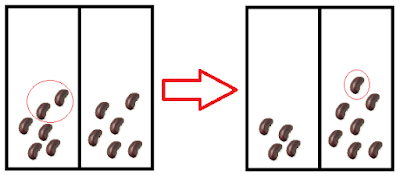

---
metadata:
    description: 'Two pints of beer and two stacks of beans: get ready for a maths game.'
title: 'Problem #006 - stacks of beans'
---

I find the problem in this post rather fun to think about because it is a problem about a game that can actually be played between two players.

===

### Problem statement

Suppose you have two stacks of beans, one with $19$ and another with $20$. John and Mary are to play a game with those beans: each turn, one of them take  $2n$ beans from one of the stacks and puts $n$ beans on the other stack, where $n$ is at least $1$. For example, in the first turn Mary could pick $10$ beans from the stack with $19$ (leaving it with $9$ beans) and then put $5$ beans in the stack that had $20$ (leaving it with $25$ beans). Mary plays first and the first player that cannot make a move loses. Does any of the players have a winning strategy?

!!! Give it some thought... My suggestion would be to try and figure out in what positions you can know for sure whether you won or lost.

This game is really simple and it is worth playing it against someone just to get a better feel for the rules. You don't have to use beans, you can use coins or cards or whatever you have at hands. Below you can find a Python script so that you can play the game against a computer. The computer is rather dumb so you shouldn't lose too often.

Just hit the green triangle to play and write your plays down in the terminal. Those plays you write are the new sizes of the stacks. For example, if you make the example play of the problem statement you would write `9, 25`. The computer goes second by default but you can change that by writing a `1` in place of the `0` in `GOES_FIRST = 0`.

<iframe allowfullscreen="true" allowtransparency="true" frameborder="no" height="400px" sandbox="allow-forms allow-pointer-lock allow-popups allow-same-origin allow-scripts allow-modals" scrolling="no" src="https://repl.it/@RojerGS/StackedBeans?lite=true" width="100%"></iframe>

If you need any clarification whatsoever, feel free to ask in the comment section below.

### Solution

You can read the solution [here][sol] to compare with your own solution.

[sol]: ../s/{{ page.slug }}
