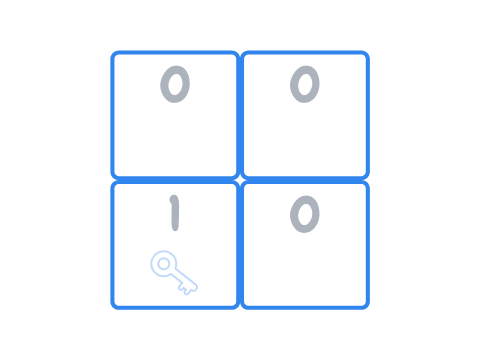
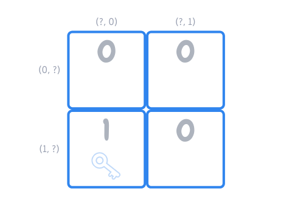
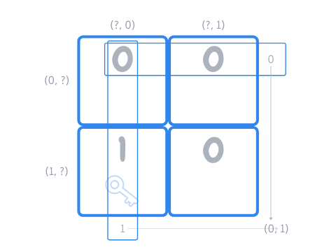

---
metadata:
    description: "Quatro caixas, quatro moedas e uma chave escondida - será que a consegues encontrar?"
title: "Problema #029 - chave escondida 2 🗝️🗝️"
---

Este problema é muito parecido com o [Problema #028 - chave escondida][p28],
mas é ligeiramente mais difícil.
Consegues resolvê-lo?

===

# Enunciado do problema

Tu e eu somos postos na prisão por motivo nenhum, mas é-nos dada uma oportunidade para
saírmos.
Eu sou levado para uma sala com quatro caixas opacas.
A chave da nossa cela é posta dentro de uma das quatro caixas, e depois uma moeda é
colocada em cima de cada uma das caixas.
Eu posso virar uma única moeda, se quiser, e depois tu entras na sala.

Quando tu entras, nós não podemos comunicar um com o outro, e tu tens de abrir uma
caixa.
Se abrires a caixa com a chave, nós podemos sair da prisão.
Se te enganares, ficamos na prisão para sempre...

Qual é que é a estratégia que tu e eu temos de combinar para que consigas encontrar
sempre a chave, a partir da disposição das moedas?

!!! Pensa um pouco...

Se precisares de clarificar alguma coisa, não hesites em perguntar na secção de comentários em baixo.

# Solução

A solução que vou partilhar neste artigo não é a minha solução original:
decidi partilhar uma [solução que foi partilhada comigo][reddit-sol]
quando eu publiquei este problema no reddit.

O que vamos começar por fazer é organizar as quatro caixas num quadrado dois por dois:

The seguida, o que fazemos é interpretar os lados das moedas como zeros e uns,
já que é mais fácil fazer contas com números do que com “lados de moedas”.
Assim, uma configuração aleatória das moedas (zeros e uns) e uma posição
aleatória da chave (escondida) podiam ser:

A próxima coisa que temos de fazer é concordar em representar cada caixa pelas
suas coordenadas, já que podemos claramente identificar cada uma das caixas
de acordo com a linha e coluna em que estão.
Para facilitar a nossa vida, vamos contar linhas e colunas a partir do zero,
por forma a que a caixa no canto superior esquerdo seja a $(0, 0)$, a do
canto superior direito seja a $(0, 1)$, a do canto inferior esquerdo seja a
$(1, 0)$ e a do canto inferior direito seja a $(1, 1)$:

No nosso exemplo, vemos que a caixa onde a chave está escondida é a $(1, 0)$.

Agora que já tratámos dos detalhes, podemos focar-nos na nossa estratégia propriamente
dita:

 - a paridade da soma dos números da primeira linha diz-me a linha em que a chave está;
 - a paridade da soma dos números da primeira coluna diz-me a coluna em que a chave está.

Estamos a falar de "paridade" da soma porque, se a primeira linha tiver dois $1$s
(ou se a primeira coluna tiver dois $1$s), então a soma é $2$, e $2$ não é o número
de nenhuma das linhas (ou colunas) de caixas.
Assim, temos que:

 - se a soma da primeira linha for par, então a chave está nas caixas de cima e
se a soma da primeira linha for ímpar, então a chave está nas caixas de baixo;
 - se a soma da primeira coluna for par, então a chave está nas caixas da esquerda
e se a soma da primeira linha for ímpar, então a chave está nas caixas da direita.

No nosso exemplo, a primeira linha tem uma soma par $0$ e a primeira coluna tem uma
soma ímpar $1$, que nos diz que a chave devia estar na caixa $(0, 1)$, o que está
errado:

No nosso exemplo específico, teríamos de virar a moeda da caixa em cima à esquerda
(i.e., fazer com que passasse a valer $1$) já que isso corrigiria a paridade da soma
da primeira linha e da primeira coluna:

Podemos ver que esta estratégia funciona sempre:

 - se os $0$s e $1$s já estiverem certos, então viramos a moeda da caixa do canto
inferior direito;
 - se os $0$s e $1$s apontarem para a linha certa mas para a coluna errada,
podemos virar a moeda da caixa do canto inferior esquerdo;
 - se os $0$s e $1$s apontarem para a coluna certa mas para a linha errada,
podemos virar a moeda da caixa do canto superior direito;
 - se os $0$s e $1$s apontarem para a linha errada e para a coluna errada
(como no nosso exemplo) então podemos virar a moeda da caixa do canto superior
esquerdo.

Não te esqueças de [subscrever a newsletter][subscribe] para receberes os problemas diretamente na tua caixa de correio,
e deixa a tua reação a este problema em baixo.

[p28]: /blog/problems/hidden-key
[subscribe]: https://mathspp.com/subscribe
[sol]: ../../solutions/{{ page.slug }}
