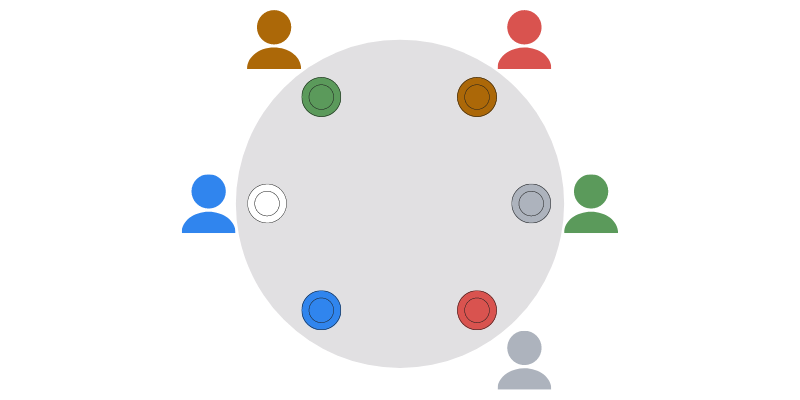

Um empregado de restaurante distribui os pedidos de forma totalmente errada.
Será que se consegue girar a mesa para que pelo menos dois pedidos fiquem à
frente da pessoa certa?

===

### Enunciado do problema

Um grupo de pessoas está sentado à volta de uma mesa redonda, à espera dos seus pedidos.
Quando a comida chega, os pratos são distribuídos de forma totalmente errada
e ninguém recebeu aquilo que tinha pedido.

Será que há _sempre_ uma maneira de girar a mesa para que duas pessoas (ou mais)
passem a ter o seu prato à sua frente?
Podes começar por testar o caso esquematizado em cima, assumindo que consegues
distinguir as cores no boneco (desculpa se não conseguires :/).

### Solução

Uma proposta de solução vai ser publicada [aqui][sol] quando tiverem passado duas semanas desde a publicação deste problema.
Podes [enviar-me um email][email], ou comentar em baixo, se quiseres que eu publique a tua [solução][sol].
<!--Podes encontrar a minha proposta de solução [aqui][sol], para confirmares a tua resposta.
Também podes usar o link para partilhar a tua própria solução nos comentários. Por favor, **não** escrevas a tua solução nos comentários aqui em baixo.-->

---

Se gostaste deste problema e se gostavas de receber novos problemas diretamente na tua caixa de correio, então [subscreve a newsletter dos Problemas][subscribe].

[email]: mailto:rodrigo@mathspp.com?subject=Resposta%20para%20{{ page.title|regex_replace(['/ /'], ['%20']) }}
[subscribe]: https://mathspp.com/subscribe
[sol]: ../../solutions/{{ page.slug }}
