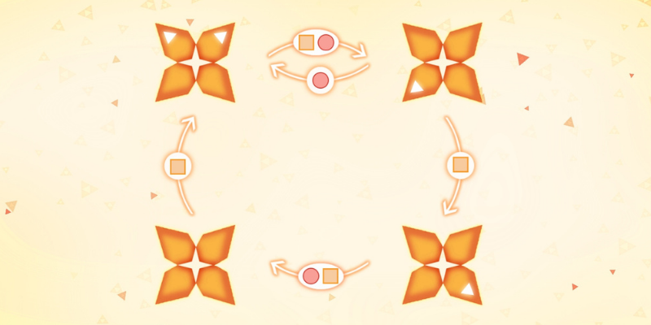

O Syncro é um jogo elegante em que tens de mover as pétalas
todas para dentro de uma única flor.
De quantos movimentos precisas para o fazer?

===

# Enunciado do problema

Olha para a imagem em cima.
A imagem tem quatro “flores”, cada uma com quatro “pétalas”.
Repara que cada flor tem uma pétala assinalada.
Também tens setas que vão de umas flores para as outras:
as formas desenhadas nas setas dizem que pétalas é que se movem
em que direção.

Por exemplo, o quadrado faz com que as pétalas assinaladas mudem
de flor na direção dos ponteiros do relógio; de forma semelhante,
a sequência “círculo + quadrado” faz com que as pétalas assinaladas
passem a ser as seguintes:

O teu objetivo é encontrar uma sequência de círculos e quadrados
que põem as pétalas assinaladas todas numa única flor, no menor
número de passos possível.

!!! Pensa um pouco...

Se precisares de clarificar alguma coisa, não hesites em perguntar na secção de comentários em baixo.

# Syncro

Syncro é um jogo desenvolvido por uns amigos meus em que o objetivo
é o de resolver vários puzzles como o que partilhei aqui.

O jogo pode ser jogado <a class="external-link no-image" href="https://rawegg.itch.io/syncro">online</a> e também existe uma
<a class="external-link no-image" href="https://play.google.com/store/apps/details?id=com.RawEgg.Syncro">aplicação Android</a>.

Se completares o jogo, até podes aparecer no [hall of fame][hof]!

# Submissões

Parabéns a todos os que conseguiram resolver o problema e,
em particular, aos que me enviaram as suas soluções:

 - Filippo M., Itália;
 - Attila K., Hungria;
 - André S., Portugal.

(A lista não está ordenada.)

# Solução

O problema é difícil de resolver sem uma representação visual do que
se está a passar, por isso deixa-me relembrar-te do aspeto do problema:

Queremos descobrir qual é a sequência mais curta de quadrados e círculos
que consegue unir os quatro triângulos brancos das pétalas numa única flor.

Vemos que o quadrado roda as pétalas todas
e que o círculo troca as pétalas de cima ao mesmo tempo que junta as
pétalas de baixo no canto inferior esquerdo.

Há algumas observações que vão ser importantes para resolver o problema:

 - não faz sentido começar com um quadrado;
 - dois círculos de seguida são redundantes;
 - a solução precisa de usar o círculo pelo menos três vezes;
 - a solução termina com um círculo.

Isto mostra que é impossível haver uma solução com menos de 5 passos,
já que o mínimo absoluto necessário é `○⎕○⎕○`, que não funciona.
Sabemos, assim, que a solução tem 6 ou mais passos.

Se testares um pouco e se fores experimentando, eventualmente hás
de encontrar uma solução de 8 passos:

 > `○⎕⎕○⎕⎕⎕○`

Esta é, efetivamente, a solução mais curta.
Para o provar, basta-nos mostrar que não há soluções de 6 ou 7 passos.
Para o fazermos "no papel" há que explorarmos as várias possibilidades
com cuidado, por isso aqui vamos:

 1. círculo – não faz sentido começar com um quadrado;
 2. quadrado – dois círculos de seguida são redundantes. Estamos assim:

$$
\begin{bmatrix} 2 & 1 \\ 0 & 1\end{bmatrix}
$$

Depois de `○⎕` não é óbvio se devemos usar um círculo ou quadrado,
por isso tentamos as duas opções:

 3. círculo – estamos a testar esta opção;
 4. quadrado – depois de um círculo vem um quadrado. É assim que estamos:

$$
\begin{bmatrix}1 & 1 \\ 0 & 2\end{bmatrix}
$$

 5. quadrado – se usarmos um círculo, voltamos ao ponto em que estávamos logo a seguir ao primeiro círculo de todos,
 e portanto teríamos desperdiçado 4 jogadas.
 Este é o estado em que estamos:

$$
\begin{bmatrix}0 & 1 \\ 2 & 1\end{bmatrix}
$$

Neste momento concluímos que não conseguimos acabar o puzzle
em 3 passous ou menos, já que ainda temos de usar, no mínimo,
os movimentos `○⎕○` e esses movimentos não resolvem o puzzle
no estado em que ele está.

Ou seja, o 3⁰ passo _não_ é um círculo:

 3. quadrado. Heis o estado do puzzle:

$$
\begin{bmatrix}0 & 2 \\ 1 & 1\end{bmatrix}
$$

 4. círculo – se usarmos um quadrado, vemos que não conseguimos acabar o puzzle a tempo.
 5. quadrado – depois dum círculo vem um quadrado.
 Estamos nesta posição:

$$
\begin{bmatrix}2 & 2 \\ 0 & 0\end{bmatrix}
$$

Os passos restantes revelam-se diante dos nossos olhos, e vemos
que o que falta é `⎕⎕○`, criando uma sequência final `○⎕⎕○⎕⎕⎕○`.

Não te esqueças de [subscrever a newsletter][subscribe] para receberes os problemas diretamente na tua caixa de correio,
e deixa a tua reação a este problema em baixo.

[email]: mailto:rodrigo@mathspp.com?subject=Resposta%20para%20{{ page.title|regex_replace(['/ /'], ['%20']) }}
[subscribe]: https://mathspp.com/subscribe
[sol]: ../../solutions/{{ page.slug }}
[hof]: /syncro
