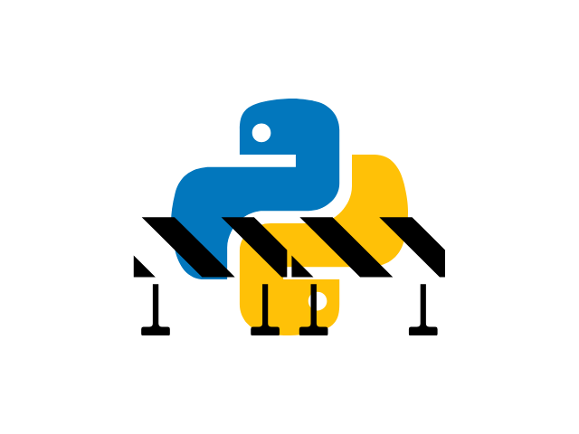

---
metadata:
    description: "The Pydon't Manifesto explains what \"Pydon'ts\" are and why they are important when you are looking to improve your Python programming skills."
title: "Pydon't Manifesto 🐍"
---

"*Pydon'ts*" are short, to-the-point, meaningful Python programming tips.
A Pydon't is something you should *not* do when programming in Python.
In general, following a Pydon't will make you write more Pythonic code.

===

# Aim

The aim of this "*Pydon't*" series is to provide a series of programming tips
for Python programmers that will take their Python programming to the next level.
This goal will be achieved by showing "bad" Python code and then comparing it
to the better, more Pythonic alternative.

# Who for

Pydon'ts are more useful for Python programmers that are looking to improve
their Python skills or for programmers that have experience in other programming
languages and are looking to expand their arsenal by learning Python.
These people are the ones that might get more bang for their buck by reading
these Pydon'ts.

Beginners will also benefit from reading these, obviously, but some of these
tips might be about topics you haven't learned yet as a beginner -- making it
the perfect opportunity to do learn said topic!

If you fit into one of these categories, be sure to
[subscribe to the Pydon't newsletter][subscribe] so you get the Pydon'ts directly
to your inbox.

# How many

At the time of writing, there's 28 Pydon'ts scheduled that can't wait to [reach
your inbox][subscribe].
I'll send you one Pydon't per week, every Tuesday,
starting on the 5th of January of 2021,
so you can kick off the new year learning something new and improving yourself!

# Format

Throughout this weekly series of Pydon'ts,
I'll (*almost*) always follow the same structure:

 1. I'll email all the newsletter subscribers with the Pydon't directly to their inboxes.
 (You can [subscribe to the newsletter][subscribe] to make sure you also get them!)
 2. The email will include the Pydon't
 and a link to a complementary blog post in case you want to learn more.

The complementary blog post will itself contain the following:

 1. The Pydon't - a short, to-the-point, meaningful Python programming tip.
 2. Code examples you can try and play around with.
 3. "Bad" and "good" code examples, so you can compare the various alternatives
 and decide for yourself if you think the Pydon't is useful or not.
 4. It may also include links for more resources for you to read up on.

---

Are you looking forward for this series?
Let me know in the comments below if you are expecting any tips about any specific
topics and leave an "emoji response" to show your support.

Also, [don't forget to subscribe to the newsletter][subscribe] so you don't miss
a single Pydon't!

[subscribe]: https://mathspp.com/subscribe
