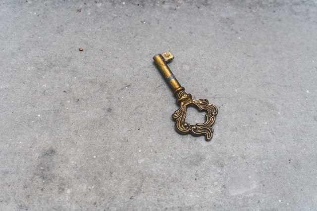

---
metadata:
    description: "Três caixas, três moedas e uma chave escondida - será que a consegues encontrar?"
title: "Problema #028 - chave escondida 🗝️"
---

Há uma chave dentro de uma de três caixas, e cada caixa tem uma moeda em cima.
Consegues usar as moedas para descobrir em que caixa a moeda está escondida?

===

# Enunciado do problema

Tu e eu somos postos na prisão por motivo nenhum, mas é-nos dada uma oportunidade para
saírmos.
Eu sou levado para uma sala com três caixas opacas.
A chave da nossa cela é posta dentro de uma das três caixas, e depois uma moeda é
colocada em cima de cada uma das caixas.
Eu posso virar uma única moeda, se quiser, e depois tu entras na sala.

Quando tu entras, nós não podemos comunicar um com o outro, e tu tens de abrir uma
caixa.
Se abrires a caixa com a chave, nós podemos sair da prisão.
Se te enganares, ficamos na prisão para sempre...

Qual é que é a estratégia que tu e eu temos de combinar para que consigas encontrar
sempre a chave, a partir da disposição das moedas?

!!! Pensa um pouco...

Se precisares de clarificar alguma coisa, não hesites em perguntar na secção de comentários em baixo.

# Solução

Há várias soluções para este problema, mas a mais simples e elegante
(de que eu tenho conhecimento) é a seguinte:
vira uma moeda, de tal forma que a caixa com a chave esteja debaixo
de uma moeda (cuja face virada para cima é) diferente das outras duas.

Esta solução é interessante porque isto funciona independentemente
de como as moedas são dispostas em cima das caixas no início.
Se ainda não o tiveres feito, convido-te a tentares mostrar que isto
que eu disse funciona.

Se numerares as caixas de $1$ a $3$, de tal modo que a caixa com
a chave seja a caixa $1$, então há $8$ configurações diferentes
para as moedas em cima das caixas.
No entanto, essas $8$ configurações não nos interessam!
Tal como no “[Problema #021 - prever o lançamento da moeda][p21]”,
o que nos interessa são as relações entre as faces das moedas, e não
as faces propriamente ditas:
interessa-nos o número de caixas cuja moeda têm a face virada para
cima igual à moeda da caixa com a chave.
Esta frase foi complexa, por isso relê-a se for necessário!

Por exemplo, se a caixa com a chave tiver a moeda com o lado "cara"
virado para cima, então uma destas três situações deve ser verdade:

 1. todas as moedas têm o lado "cara" virado para cima.
 2. há duas moedas com o lado "cara" virado para cima, uma em cima
da caixa com a chave e outra em cima de uma caixa vazia.
 3. só há uma moeda com o lado "cara" virado para cima, que está
em cima da caixa com a chave.

Se estivermos na situação 1., então viramos a moeda em cima da caixa
com a chave, para que a sua face virada para cima passe a ser
"coroa" (e é a única moeda com "coroa" virada para cima).
Se estivermos na situação 2., então viramos a moeda que tem "cara"
virada para cima e que está em cima de uma caixa vazia, de tal forma
que agora a única moeda com "cara" virada para cima está em cima da
caixa com a chave.
Se estivermos na situação 3., então não precisamos de fazer nada!

Se a caixa com a chave estiver debaixo de uma moeda com o lado
"coroa" virado para cima, então seguimos as instruções que estavam
aqui em cima, depois de trocarmos todas as ocorrências da palavra
"coroa" por "cara", e vice-versa.

Não te esqueças de [subscrever a newsletter][subscribe] para receberes os problemas diretamente na tua caixa de correio,
e deixa a tua reação a este problema em baixo.

[subscribe]: https://mathspp.com/subscribe
[sol]: ../../solutions/{{ page.slug }}
