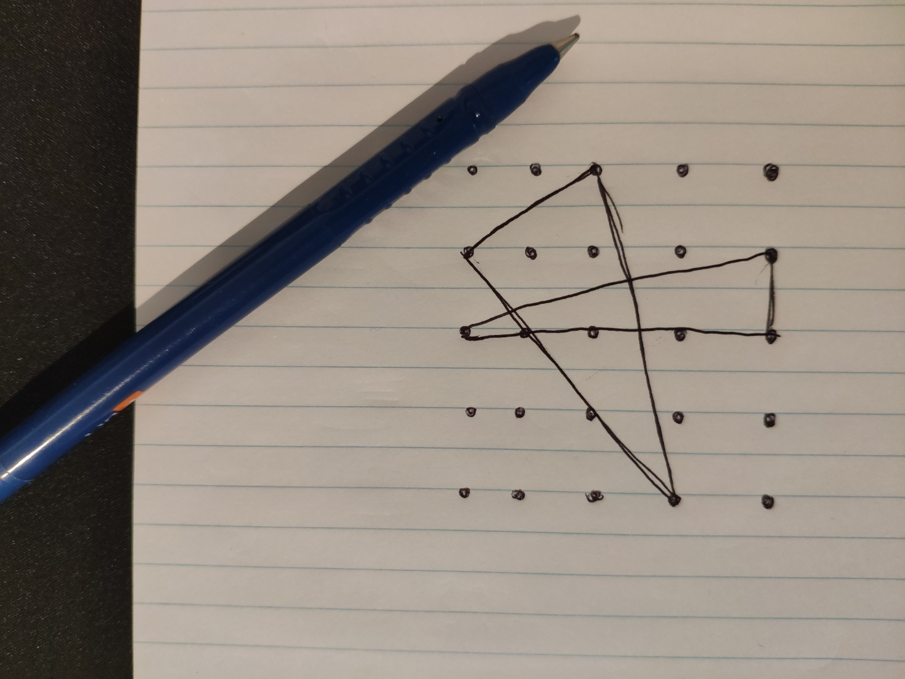

Consegues desenhar 4 triângulos nesta grelha 5 por 5 e cobrir todos os pontos?

===

# Enunciado do problema

O teu objetivo é desenhar 4 triângulos numa grelha 5 por 5.
Claro que há algumas restrições:

 - todos os vértices de todos os triângulos têm de estar sobre pontos da grelha;
 - os 25 pontos da grelha têm de ser atravessados por uma aresta de algum triângulo,
 ou estar sob algum vértice; e
 - os triângulos não podem ter ângulos de 90⁰ (por este motivo, concluímos que a imagem em cima não é parte da solução, já que o triângulo da direita tem um ângulo de 90⁰).

!!! Pensa um pouco!

Se precisares de clarificar alguma coisa, não hesites em perguntar na secção de comentários em baixo.

Eu encontrei este problema no site [Puzzling][source] da família
de sites do Stack Exchange.

# Submissões

Parabéns a todos os que conseguiram resolver o problema e,
em particular, aos que me enviaram as suas soluções:

 - David H., Taiwan;
 - Michael W., Estados Unidos;
 - Pedro G., Portugal;
 - B. Praveen R., Índia;
 - Kees L., Países Baixos;
 - Jerry J., Estados Unidos;
 - Mihalis G., Grécia;
 - Alfredo E., México;
 - Martin J., República Checa;

Junta-te à comunidade e envia-me a tua solução por [email]!

# Solução

Há muitas soluções diferentes para este problema.

Dos Estados Unidos (Jerry), foi-me enviada a solução de que eu gostei mais:

Esta solução é a minha preferida por causa da simetria vertical entre os dois triângulos maiores
e porque os dois triângulos mais pequenos são uma rotação um do outro.

Para referência, incluo aqui outra solução (de entre as muitas que existem!);
esta é do Martin, e escolhi-a aleatoriamente entre as várias que recebi.

Não te esqueças de [subscrever a newsletter][subscribe] para receberes os problemas diretamente na tua caixa de correio.

[email]: mailto:rodrigo@mathspp.com?subject=Resposta%20para%20{{ page.title|regex_replace(['/ /'], ['%20']) }}
[subscribe]: /subscribe
