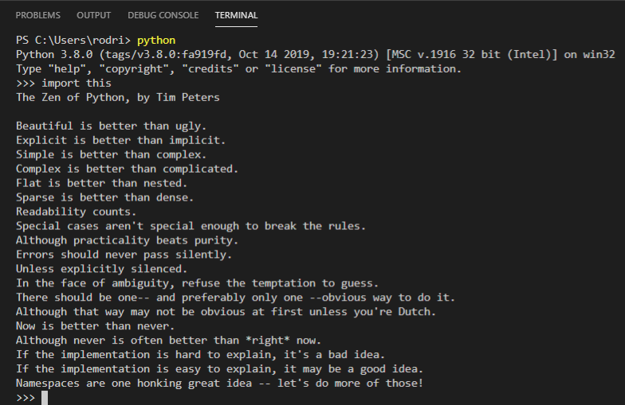

[_Py-don'ts_][pydont] are anti-tips for writing good Python code. Sometimes learning what is good isn't enough. You have to compare it with what is bad as well!

===



From now on I will take on the responsibility of showing you some bad Python code, explaining why it is bad and how to make it better.

My anti-tips will not be on particular algorithms or on libraries to use. I will be showing you _ugly_ code, so that you better appreciate elegant code. In mathematics some proofs are more elegant than others, and usually the elegant proofs are easier to understand and make more sense. The same applies to ugly/elegant code. Elegant code is usually easier to understand and sometimes even more performant!

But what sets the standards of elegant code? Well, if you `import this` in Python, you are presented with the _Zen of Python_, a set of guidelines you could and should follow when coding:
 
```
The Zen of Python, by Tim Peters

Beautiful is better than ugly.
Explicit is better than implicit.
Simple is better than complex.
Complex is better than complicated.
Flat is better than nested.
Sparse is better than dense.
Readability counts.
Special cases aren't special enough to break the rules.
Although practicality beats purity.
Errors should never pass silently.
Unless explicitly silenced.
In the face of ambiguity, refuse the temptation to guess.
There should be one-- and preferably only one --obvious way to do it.
Although that way may not be obvious at first unless you're Dutch.
Now is better than never.
Although never is often better than *right* now.
If the implementation is hard to explain, it's a bad idea.
If the implementation is easy to explain, it may be a good idea.
Namespaces are one honking great idea -- let's do more of those!
```

The Zen of Python was written by [Tim Peters][tim-peters], a software engineer that contributed a whole lot to Python and to the Python community.

Personally I think the Zen of Python is pretty self-explanatory, apart from the joke about Dutch people* and the reference to namespaces, a particular feature of Python. As the next few [_py-don't_][pydont] posts are published, we will be breaking the Zen of Python fairly often, so stay tunned!

Feel free to leave a comment if there is a [_py-don't_][pydont] you want to suggest!

(*) Come to think of it, this may or may not be a reference to [Guido van Rossum][guido], the creator of Python. Guido is Dutch.

[tim-peters]: https://en.wikipedia.org/wiki/Tim_Peters_(software_engineer)
[guido]: https://en.wikipedia.org/wiki/Guido_van_Rossum
[pydont]: https://mathspp.com/blog/pydonts