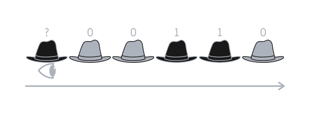
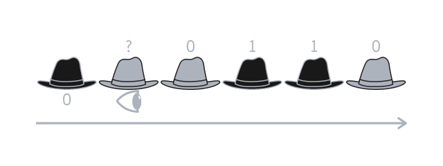
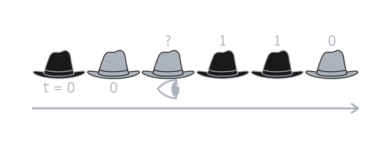
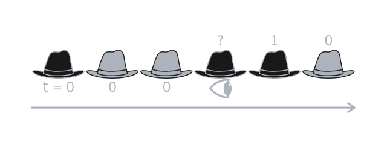
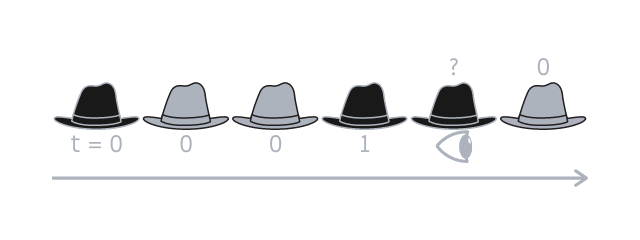
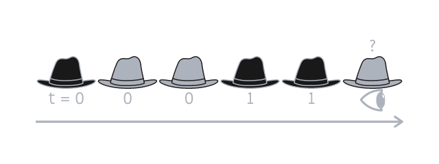

---
metadata:
    description: Este artigo contém a minha proposta de solução para um dos problemas deste blogue.
title: 'Solução #024 - chapéus em fila'
---

Este artigo contém a minha solução proposta para o [Problema #024 - chapéus em fila][prob]. Por favor não leias esta solução se ainda não tentaste resolver [o problema][prob] a sério.

===

### Solução

Vamos supor que há $n$ pessoas na fila.
Vamos ver que a melhor estratégia salva sempre $n - 1$ pessoas e salva a
$n$-ésima pessoa com $50\%$ probabilidade.

Para fazer isto, precisamos de fazer duas coisas:

 1. Mostrar que não há nenhuma estratégia melhor.
 2. Mostrar que há uma estratégia que funciona com esta eficácia.

Sempre que tento resolver um problema deste tipo, em que estamos à procura “da
melhor estratégia possível”, a minha estratégia é ser otimista.
Se alguém te coloca um problema deste estilo, *geralmente* é porque há uma
estratégia incrível com uma eficácia bestial.
Quando esse é o caso, eu tento sempre procurar primeiro uma estratégia que seja
**perfeita**.
Na maior parte dos casos, se não há uma estratégia perfeita então costuma haver
uma que é quase perfeita.

Para este problema específico, conseguimos perceber que não há uma estratégia
que seja perfeita: a pessoa que vá tentar adivinhar o tom do seu chapéu primeiro
não tem informação **nenhuma** para além dos tons dos chapéus das pessoas à sua
frente.
Essa informação é completamente inútil, porque os tons dos chapéus dos outros
são completamente independentes do tom do seu próprio chapéu.
Deste modo, a primeira pessoa a tentar adivinhar nunca conseguirá uma taxa de
sobrevivência melhor que $50\%$, que é a taxa de sucesso de um palpite
aleatório.

Só depois da primeira pessoa ter tentado adivinhar é que as coisas ficam
interessantes, porque a pessoa que diz um palpite primeiro pode usar esse
palpite para passar *alguma* informação para as outras $n-1$ pessoas e, com um
pouco de engenho, permitir que todas elas acertem nos seus próprios chapéus.

Vou mostrar como.
Para tornar esta explicação mais simples de seguir, vamos identificar os chapéus
escuros com o número $1$ e os chapéus claros com o número $0$.

A primeira pessoa a fazer um palpite sobre o seu chapéu vai ser a pessoa que
está no fim da fila, já que essa pessoa é a que tem mais informação disponível
porque consegue ver os chapéus de todos os outros.
Por exemplo, se $n = 6$ os chapéus podiam estar distribuídos no padrão
$1~0~0~1~1~0$ e a pessoa no fim da fila está representada pelo $1$ na ponta
esquerda da sequência que escrevi.

A primeira pessoa sabe, então, que o padrão de chapéus é $?~0~0~1~1~0$, sendo
que só não sabe o tom do seu próprio chapéu.

A primeira pessoa soma os valores dos chapéus à sua frente, que dá $2$ no nosso
exemplo, e verifica qual é a paridade desse número (i.e. responde à pergunta “o
número é par ou ímpar?”). $2$ é par, claro.

A primeira pessoa é incumbida de usar essa paridade como o seu próprio palpite,
para que depois todos os outros adivinhem sucessivamente os tons dos seus
chapéus, tal como um dominó.

No nosso exemplo temos que a soma (que deu $2$) é par, logo a primeira pessoa
palpita que o seu chapéu é claro, já que essa é a cor associada com o $0$.
(Infelizmente, neste caso a primeira pessoa não adivinha a cor do seu chapéu,
mas sacrificou-se para que todos os outros se consigam salvar!)
Depois disso, a segunda pessoa sabe que o seu chapéu, mais os à sua frente,
devem ter uma soma com uma paridade específica.

A segunda pessoa vê $n - 2$ chapéus e sabe a paridade deles todos.
Para além disso, esses chapéus visíveis *mais* o seu devem ter uma soma com a
paridade que a primeira pessoa identificou.
Isto significa que a segunda pessoa consegue adivinhar o seu próprio chapéu.
No nosso exemplo, a segunda pessoa vê vários chapéus cuja soma dá $2$, que é
par, e sabe ainda que o número $2$ mais o número do seu chapéu deve dar um
resultado par (o palpite da pessoa anterior).
Assim, a segunda pessoa conclui que o seu chapéu tem de estar associado ao
número $0$ e que portanto é claro.

Depois o processo repete-se para todos os outros.
Vamos usar indução para provar que este processo funciona bem.
Vamos mostrar que, se as pessoas $2, 3, \cdots, k$ adivinharam o seu chapéu,
então a pessoa $k + 1$ também consegue.
O caso base é provar que a pessoa $2$ consegue adivinhar, e nós já fizemos isso.

Vamos usar $h_i$ para representar o número associado ao chapéu da pessoa $i$.
No nosso exemplo temos $h_1 = h_4 = h_5 = 1$ e $h_2 = h_3 = h_6 = 0$.
A nossa hipótese de indução diz-nos que os valores $h_2, \cdots, h_k$ são
conhecidos (porque as pessoas $2, \cdots, k$ adivinharam os tons dos seus
chapéus) e também sabemos a paridade de $t = h_2 + h_3 + \cdots + h_n$, porque a
paridade de $t$ é a pista que a primeira pessoa nos dá.
Finalmente, a pessoa $k+1$ consegue ver, com os seus próprios olhos, os valores
$h_{k+2}, \cdots, h_n$.
Intuitivamente falando, a paridade de $t$ depende da paridade de $n - 1$
variáveis e a pessoa $k + 1$ sabe quanto é que $n - 2$ dessas variáveis valem,
ficando a sobrar a variável que diz respeito ao seu chapéu:

$$
t - \left(h_2 + \cdots + h_k \right) - \left(h_{k+2} + \cdots h_n \right) =
h_{k+1} \text{ mod } 2
$$

Claro que só conseguimos fazer isto $\text{mod } 2$ porque só conseguimos
trabalhar com paridades, mas isso é suficiente.

Isto prova que a estratégia funciona.
Agora vamos completar o exemplo para ajudar a compreender a prova.

A terceira pessoa sabe que os chapéus seguem o seguinte padrão: $?~0~?~1~1~0$ e sabe que
$0~?~1~1~0$ devia ter uma soma que seja par.

A terceira pessoa pode adivinhar que o seu chapéu é claro, já que
$0~+~? + 1 + 1 + 0$ só tem um valor que seja par se o seu próprio chapéu (o $?$)
for $0$.

A seguir é a quarta pessoa, que sabe que os chapéus seguem o seguinte padrão:
$?~0~0~?~1~0$ e sabe que $0~0~?~1~0$ devia ter uma soma que seja par.

A quarta pessoa pode adivinhar que o seu chapéu é escuro, já que
$0 + 0~+~? + 1 + 0$ só tem um valor que seja par se o seu próprio chapéu for $1$.

A seguir é a quinta pessoa, que sabe que os chapéus seguem o seguinte padrão:
$?~0~0~1~?~0$ e sabe que $0~0~1~?~0$ devia ter uma soma que seja par.

A quinta pessoa pode adivinhar que o seu chapéu é escuro, já que
$0 + 0 + 1~+~? + 0$ só tem um valor que seja par se o seu próprio chapéu for $1$.

A seguir é a última pessoa, a sexta, que sabe que os chapéus seguem o seguinte padrão:
$?~0~0~1~1~?$ e sabe que $0~0~1~1~?$ devia ter uma soma que seja par.

A última pessoa pode adivinhar que o seu chapéu é claro, já que
$0 + 0 + 1 + 1~+~?$ só tem um valor que seja par se o seu próprio chapéu for $0$.

E o exemplo está concluído!
Espero que a explicação tenha sido clara!

Se tens alguma questão sobre a minha solução, se encontraste algum erro (woops!) ou se gostavas de partilhar a *tua* solução, deixa um comentário em baixo.

Já agora, [não te esqueças de subscrever a newsletter][subscribe] para receberes
um problema diretamente no teu email de quinze em quinze dias!

[prob]: ../../problems/{{ page.slug }}
[subscribe]: https://mathspp.com/subscribe
