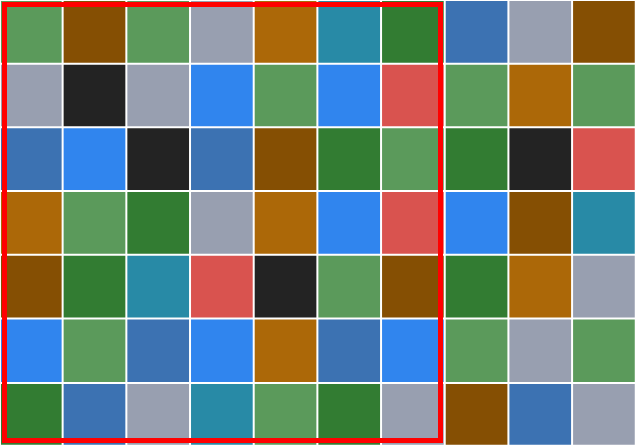
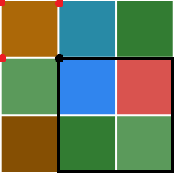

---
metadata:
    description: Este artigo contém a minha proposta de solução para um dos problemas deste blogue.
title: 'Solução #026 - contar quadrados'
---

Este artigo contém a minha solução proposta para o [Problema #026 - contar quadrados][prob].
Por favor não leias esta solução se ainda não tentaste resolver [o problema][prob] a sério.

===

### Solução

Vamos contar o número de quadrados nesta grelha 7 por 10:

Este é um tipo de problema que me aparece frequentemente nas redes sociais.
Quando espreito a secção dos comentários é raro encontrar duas pessoas que
tenham chegado à mesma resposta final, o que significa que *muita* gente
chega a uma resposta errada!

Uma maneira de garantir que não nos enganamos é se descobrirmos qual é a fórmula
que dá a resposta certa, em vez de desenharmos os quadrados no ar com a mão
enquanto os vamos contando.

Vou partilhar contigo o modo como *eu* costumo fazer isto:
eu costumo olhar para o quadriculado e descubro qual é o maior quadrado que cabe
lá dentro.
O quadriculado aqui é 7 por 10, portanto o maior quadrado que cabe lá dentro é 7 por 7,
tal como o da figura em baixo:

Depois, tudo o que é preciso fazer é descobrir quantos quadrados, de cada tamanho,
é que cabem na grelha.
Este é um raciocínio semelhante ao [deste artigo sobre probabilidades][pokemon]:
em vez de resolvermos um problema grande, vamos parti-lo em vários subproblemas
e resolver cada um desses à vez.
Assim, temos de descobrir quantos quadrados $1\times 1$ cabem na grelha,
quantos $2\times 2$ cabem, etc, até calcularmos quantos quadrados $7\times 7$ cabem
na grelha.

Por exemplo, numa grelha mais pequena, 3 por 3, há 9 possíveis localizações para
o canto superior esquerdo de um quadrado $1\times 1$, e mostro todas na figura em baixo.
Um dos possíveis locais é mostrado com o seu quadrado $1\times 1$ respetivo.

Se considerarmos, por exemplo, quadrados $2\times 2$ em vez de quadrados
$1\times 1$, quantos sítios é que ainda podem ser o canto superior esquerdo
do quadrado?
Agora que o quadrado é maior, as localizações que estavam mais à direita ou mais
em baixo já não servem, porque não têm espaço suficiente para um quadrado $2\times 2$.
Agora só temos 4 localizações úteis, que mostro nesta imagem:

Tudo o que interessa para este processo é o cálculo de quantas localizações podem
conter o canto superior esquerdo do quadrado.
Numa grelha $n \times m$, quantas posições podem ser o canto superior esquerdo de um
quadrado $k\times k$, assumindo que $k \leq \min(n, m)$?
Ao longo do lado de comprimento $n$ podemos usar $n - k + 1$ posições, e ao longo
do lado de comprimento $m$ podemos usar $m - k + 1$ posições.
Se cruzarmos as possibilidades, obtemos $(n-k+1)(m-k+1)$ posições.

Pensa (e vai desenhando enquanto lês) que tens uma linha de comprimento $n$,
dividida em segmentos de tamanho $1$ (e portanto, dividida em $n$ segmentos desses).
Agora queremos contar quantos segmentos de tamanho $k$ podem ser desenhados sobre
o segmento de tamanho $n$, assumindo que os segmentos pequenos de tamanho $k$
têm de estar alinhados com as secções de tamanho $1$.
Deves concluir que há $n - k + 1$ desses.
Por exemplo, se o segmento maior tiver comprimento $7$ e se tu quiseres desenhar
segmentos de tamanho $4$, vais ver que consegues desenhar $4$ diferentes, porque
$7 - 4 + 1 = 4$.

Assim, uma grelha $n \times m$ tem $(n - k + 1)(m - k + 1)$ quadrados de tamanho $k \times k$.

Agora só nos falta considerar os vários valores possíveis de $k$, que numa grelha
$7 \times 10$ vão de $1$ a $7$.
Se $S(n, m)$ for o número de quadrados numa grelha $n \times m$, com $n \leq m$,
então temos que

$$
S(n, m) = \sum_{k = 1}^{n} (n-k+1)(m-k+1) ~ .
$$

Para o nosso caso, queremos calcular $S(7, 10)$:

$$
S(7, 10) = (7\times 10) + (6\times 9) + (5\times 8) + (4\times 7) + (3\times 6) + (2\times 5) + (1\times 4) = 224 ~ .
$$

Concluímos então que há $224$ quadrados numa grelha $7\times 10$, e aqui estão
todos eles:

O processo que usámos para contar o número de quadrados na grelha também pode ser
usado para contar os retângulos que cabem na grelha.
Consegues fazê-lo?
Faz-me saber na secção de comentários em baixo!

Se tens alguma questão sobre a minha solução, se encontraste algum erro (woops!) ou se gostavas de partilhar a *tua* solução, deixa um comentário em baixo.
Caso contrário podes só deixar um “upvote”!

Já agora, [não te esqueças de subscrever a newsletter][subscribe] para receberes
um problema diretamente no teu email de quinze em quinze dias!

[subscribe]: https://mathspp.com/subscribe
[pokemon]: /blog/filling-pokedex-with-random-trades
[prob]: ../../problems/{{ page.slug }}
