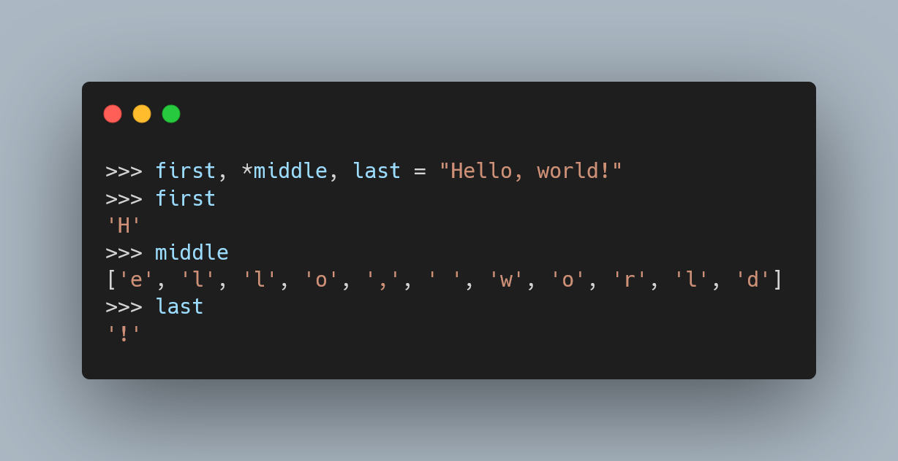

Today I learned strings can also be unpacked in Python.

===




# String unpacking

I've written a couple of Pydon't articles about unpacking before,
namely [one about unpacking with starred assignments][pydont-unpacking],
and [another one about deep (structural) unpacking][pydont-deep-unpacking].

Having said that, I have _no idea_ why I was so surprised, earlier today,
when I found out that strings can be unpacked in Python:

```py
>>> a, b = "Hi"
>>> a
'H'
>>> b
'i'
```

In hindsight, I already possessed all the knowledge to arrive at this conclusion...

And yet, when I saw it in my face, it baffled me!

Now, whether or not this is a helpful thing...
That's a whole different discussion!

But there you have it, something interesting about Python.

(Pssst, no one else is looking, check out this horror:

```py
>>> first, *middle, last = "Hello, world!"
>>> first
'H'
>>> middle
['e', 'l', 'l', 'o', ',', ' ', 'w', 'o', 'r', 'l', 'd']
>>> last
'!'
```

Would you get fired if you wrote things like this in production?)

That's it for now! [Stay tuned][subscribe] and I'll see you around!


[subscribe]: /subscribe
[pydont-unpacking]: /blog/pydonts/unpacking-with-starred-assignments
[pydont-deep-unpacking]: /blog/pydonts/deep-unpacking
