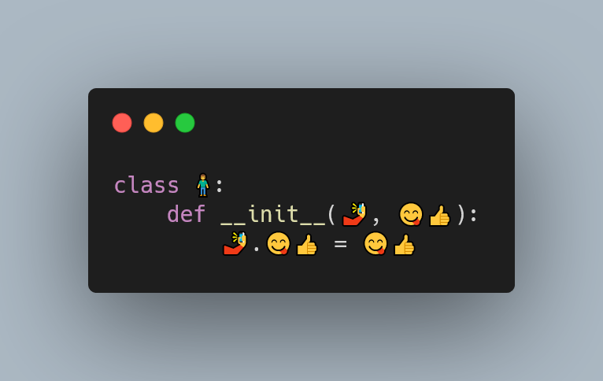

Today I learned that you can use emojis as variable names in Python if you use `pythonji`.

===




# Can you use emojis in Python?

No!
At the time of writing, emojis are not valid Python identifiers.
This means that this code fails:

```py
>>> 🍔 = "hamburguer"   # SyntaxError
```

However, if you install the package [`pythonji`][pythonji],
you will be able to run code like that!

Installing `pythonji` is as easy as `python -m pip install pythonji`!

With `pythonji` installed, we can run programs that make use of emojis!

Here's a little program I wrote:

```py
import enum

class 🍽(enum.Enum):
    🍔 = "hamburguer"
    🍕 = "pizza"
    🍅 = "tomato"
    🥕 = "carrot"

class 🧍:
    def __init__(🤳, 😋👍):
        🤳.😋👍 = 😋👍

    def 🍽(🤳, 😋):
        if 😋 in 🤳.😋👍:
            return "Yummi!"
        else:
            return "Ok, I'll eat that."
            
👨 = 🧍([🍽.🍕, 🍽.🥕])
print(👨.🍽(🍽.🍕))
print(👨.🍽(🍽.🍅))
```

Save it to the file `foo.🐍` (yes, the extension really is 🐍!).

Now, run it with `pythonji foo.🐍` and this is the output:

```bash
 > pythonji foo.🐍
Yummi!
Ok, I'll eat that.
```

Amazing, right? 😆

That's it for now! [Stay tuned][subscribe] and I'll see you around!


[subscribe]: /subscribe
[pythonji]: https://github.com/gahjelle/pythonji
