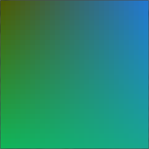

---
metadata:
    description: In this post I show you a colourful game I wrote with a friend of
        mine.
title: 'HueHue: a colourful game'
---

**HueHue** is a very colourful game I wrote with my colleague [@inesfmarques][ines].

===

We programmed a small puzzle game, based solely on colours, that we called HueHue (please mind that the idea for how the game works is not ours). The way the game works is pretty straightforward: you start with a bunch of coloured tiles all mixed up, like in the image above, and then you want to organize them to create a degradee like the one below! The only thing you can take for granted is that the four corners are already correctly placed (and you can't move them, just to prevent accidents).

The instructions are also quite simple: you use left and right clicks to swap tiles. Whenever you left-click a tile, you are telling the game that you will want to swap that tile. Whenever you right-click a tile, that tile gets swapped with the last tile you left-clicked! Simple, right?

Or you can just drag the tiles around, that is even simpler.

When you finish the puzzle and rearrange the degradee, the window caption changes and you can't swap any more tiles. To change the number of tiles in the puzzle or their sizes edit the file `HueHueConfig.py`.

When we had the game logic already implemented but were still testing the way we would create the degradee, I created another small script that just populates the screen with a random degradee like the one below. 

You can find the code for the game and for the random degradee generator in [this GitHub folder][huehuegh]. Enjoy!

How would you improve this game? Let me know in the comments below.

[ines]: https://github.com/inesfmarques/
[huehuegh]: https://github.com/RojerGS/minigames/tree/master/huehue