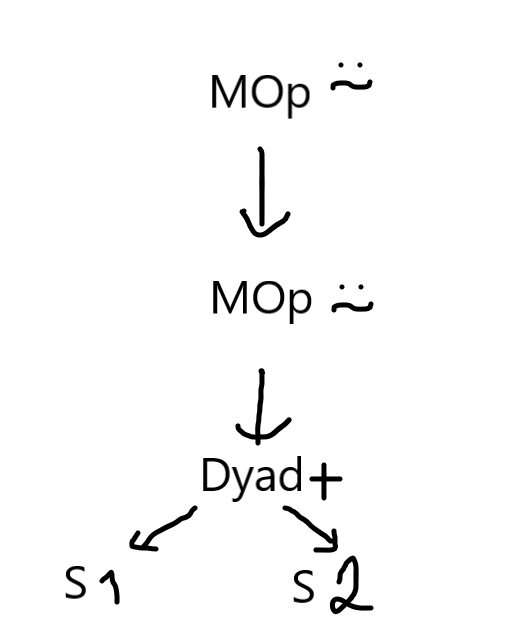
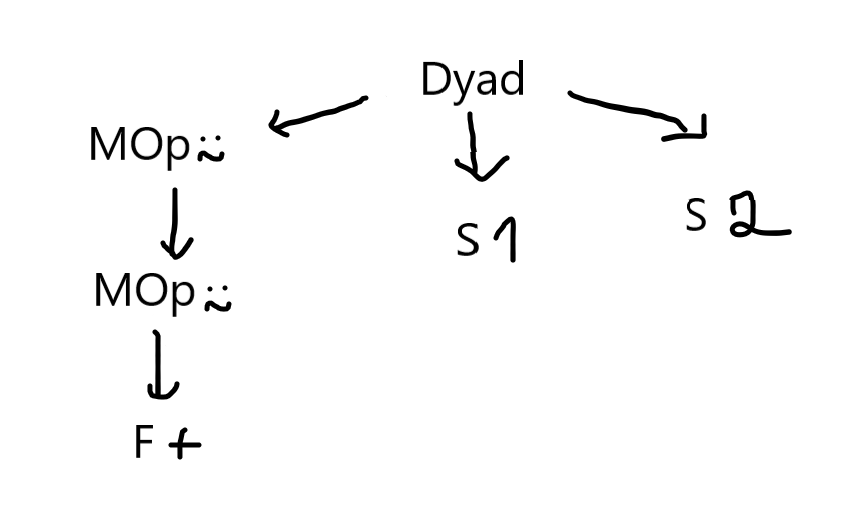
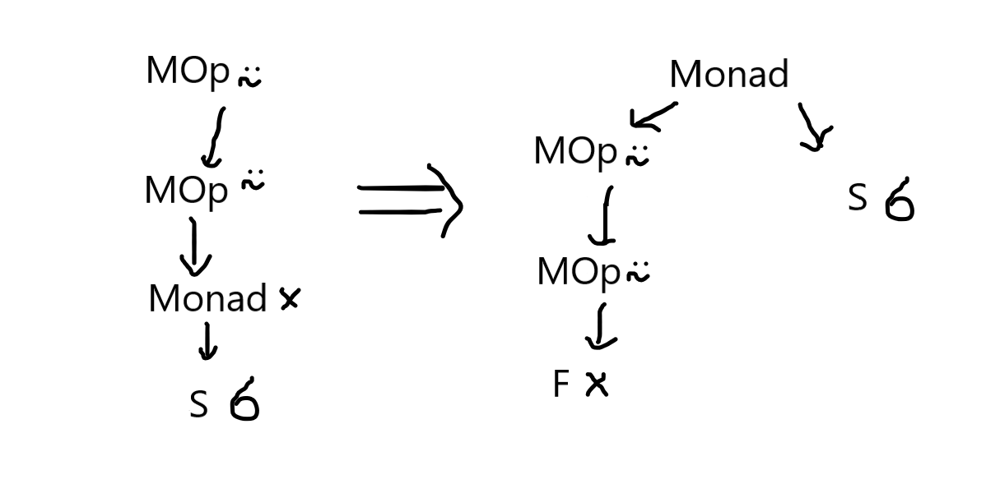

Today is the day! Today is the day we take our [APL][apl-wiki] programs and interpret them, so that something like `÷ 1 2 3 -⍨ 1.1 2.2 3.3` can output `10 5 3.33333333`.

===


Just to get us started, here are two ASTs, two Awfully Sketched Trees.

# Recap

If you recall, in the [last blog post][previous] of the series (which was also the first!) we created a simple program that took a basic [APL][apl-wiki] expression (APL is a really cool array-oriented programming language), tokenized it and then parsed it into an AST, an Abstract Syntax Tree. You can test that program online [here][repl-part1].

With that program, we can turn an expression like `5 6 -⍨ ÷1 2`

 - into a list of tokens like `[Token(EOF, None), Token(INTEGER, 5), Token(INTEGER, 6), Token(MINUS, -), Token(COMMUTE, ⍨), Token(DIVIDE, ÷), Token(INTEGER, 1), Token(INTEGER, 2)]`
 - and into an AST like `MOp(⍨ Dyad(- A([S(5), S(6)]) Monad(÷ A([S(1), S(2)]))))`

# Today

Today we are going to:

 1. implement assignment of scalars/arrays;
 1. allow for several statements split by `⋄`;
 1. implement the [Visitor pattern][visitor-wiki] to interpret an AST and produce the final result. You can check [Spivak's 8th post][lsbasi-part8] to see how he did it.

(writing this list was easy, I just went to the previous blog post and copied the list of things we would get done for today!)

Additionaly, to make the above changes easier to implement, I am also going to redesign some of the things that were already done. Please don't be mad at me! Quoting my previous post,

 > _"By the way, this might be a great moment to let you know that I make mistakes! Lots of them!"_

So we are actually starting with refactoring the parser and the way we represent monadic/dyadic function application. I decided to make this change when I realized implementing all the APL [operators][apl-wiki-op] was going to be a real headache.

To make my changes easier to understand, we will study the AST generated for the simple expression `1 +⍨⍨ 2`. If you [test it online](repl-part1) the program will print `MOp(⍨ MOp(⍨ Dyad(+ S(1) S(2))))`, which can be drawn as:



What I don't like about this AST is that I don't know if the operator `⍨` is acting in a monadic or dyadic function until I reach the bottom of the tree, where I have my function and my two arguments. If you type the same expression `1 +⍨⍨ 2` in [this series parser][repl-part2] the output printed is a list with the single element `Dyad(MOp(⍨ MOp(⍨ F(+))) S(1) S(2))` in it; this tree can be represented as:



With the new tree I have clearly separated the issue of finding the function I will apply from the arguments to which the function will be applied. I am also guessing this will make it easier to later implement things like [trains][apl-wiki-trains] and assigning functions to variables.

I challenge you modify the AST nodes and the parser yourself to produce trees like these for dyadic function applications. Monadic function application undergoes a similar change, exemplified in the picture below for the expression `×⍨⍨ 6`:



## The code

[][rgspl-repo]&nbsp;&nbsp;&nbsp;[][repl-part2]

The whole code for this project is hosted in [this][rgspl-repo] GitHub repo and the code for this specific blog post is [this subfolder][rgspl2]. You can also test today's code in your browser by hitting the "run on repl.it" button above.

---

Now that we got this out of the day, lets dive right into the changes for today.

# Updated grammar

Because we want to support assignments and multiple consecutive statements (separated by the diamond `⋄` glyph) we will start by taking a look at the new grammar:

```
program := EOF statement_list
statement_list := (statement "⋄")* statement
statement := ( ID "←" | array function | function )* array
function := f | function mop
mop := "⍨"
f := "+" | "-" | "×" | "÷" | "⌈" | "⌊"
array := scalar | ( "(" statement ")" | scalar )+
scalar := INTEGER | FLOAT | ID
```

The main differences are in:

 - the new `program` definition that now consists of a `statement_list` followed by an `EOF` token, where the statement list is exactly that, a list of statements separated by `⋄`;
 - the `statement` rule was modified to include assignments as a special type of statement, which is a `←` followed by an `ID` token, used for variables.

# Changing the `Token` class

To implement these differences, first things first we need to update our tokens in the `Token` class; let us also take this opportunity to reorder our tokens in an attempt to organize them into sensible groups:

```py
class Token:
    """Represents a token parsed from the source code."""

    # "Data types"
    INTEGER = "INTEGER"
    FLOAT = "FLOAT"
    ID = "ID"
    # Functions
    PLUS = "PLUS"
    MINUS = "MINUS"
    TIMES = "TIMES"
    DIVIDE = "DIVIDE"
    CEILING = "CEILING"
    FLOOR = "FLOOR"
    # Operators
    COMMUTE = "COMMUTE"
    # Misc
    DIAMOND = "DIAMOND"
    NEGATE = "NEGATE"
    ASSIGNMENT = "ASSIGNMENT"
    LPARENS = "LPARENS"
    RPARENS = "RPARENS"
    EOF = "EOF"

    # Helpful lists of token types.
    FUNCTIONS = [PLUS, MINUS, TIMES, DIVIDE, FLOOR, CEILING]
    MONADIC_OPS = [COMMUTE]

    # What You See Is What You Get characters that correspond to tokens.
    # The mapping from characteres to token types.
    WYSIWYG_MAPPING = {
        "+": PLUS,
        "-": MINUS,
        "×": TIMES,
        "÷": DIVIDE,
        "⌈": CEILING,
        "⌊": FLOOR,
        "⍨": COMMUTE,
        "←": ASSIGNMENT,
        "(": LPARENS,
        ")": RPARENS,
        "⋄": DIAMOND,
    }

    ID_CHARS = "_abcdefghijklmnopqrstuvwxyzABCDEFGHIJKLMNOPQRSTUVWXYZ"
```

# Updating the `Tokenizer`

After defining our new tokens we need to tell the `Tokenizer` when to create them. Here comes _another_ thing I decided to do differently. Variable names can start with letters and then include numbers, e.g. `var1`, `s46sx` and `_1d` are all valid variable names... and with my tokenizer working backwards, upon reaching the `1` in `var1` I would have to peek at the following characters to decide whether to tokenize a number or a variable name. For this reason, I changed the `Tokenizer` to start at the beginning of the string and in the end just reverse the list of tokens.

Because of this change there is a fair share of uninteresting changes that must be done in some `Tokenizer` methods like `__init__()`, `advance()`, `get_integer()`, `get_number_token()`, `get_wysiwyg_token()` and `tokenize()`. A nice exercise would be for you to change these methods so that the `Tokenizer` goes from the beginning of the source string to the end but then returns a reversed list of `Token`s.

You can check those changes by scrolling down in [this GitHub diff](https://github.com/RojerGS/RGSPL/compare/bdd67edc9339f9e4598bcb188db66908b785f13d...cea3093f84361c57ac16d00c3a2eceb74258365e) and loading the diff for the `rgspl.py` file.

Besides those changes, we have to accomodate for our new `ID` Token with a `get_id_token()` method and by adapting our `get_next_token()` method:

```py
class Tokenizer:
    """Class that tokenizes source code into tokens."""

    # ...

    def get_id_token(self):
        """Retrieves an identifier token."""

        start = self.pos
        while self.current_char and self.current_char in Token.ID_CHARS:
            self.advance()
        return Token(Token.ID, self.code[start:self.pos])

    def get_next_token(self):
        """Finds the next token in the source code."""

        self.skip_whitespace()
        if not self.current_char:
            return Token(Token.EOF, None)

        if self.current_char in "¯0123456789":
            return self.get_number_token()

        if self.current_char in Token.ID_CHARS:
            return self.get_id_token()

        if self.current_char in Token.WYSIWYG_MAPPING:
            return self.get_wysiwyg_token()

        self.error("Could not parse the next token...")
```

Because we also allow for numbers in our variables, as we included the numbers `"0123456789"` in `Token.ID_CHARS`, we only check if the current character is in `Token.ID_CHARS` _after_ checking if the current character is a number. This allows for numbers to match first, which is what we want because a variable cannot start with a number.

# Changes to the `ASTNode` subclasses

## Utility change to `ASTNode`

For the sake of brevity we define the `AST.__repr__()` method as `self.__str__()` and leave `AST.__str__()` undefined; then for each `ASTNode` subclass we only have to define the magic method `__str__()` as we get the `__repr__()` for free with inheritance.

## New `ASTNode` subclasses

From the updated grammar, both from the new functionalities and the changes I had to make because I changed my mind about the old grammar, we need to modify these `ASTNode` subclasses:

 - `Monad` - now represents a monadic function call instead of a function called monadically (c.f. the drawings above);
 - `Dyad` - now represents a dyadic function call instead of a function called dyadically (c.f. the drawings above).

and create these new subclasses:

 - `F` - to hold a function;
 - `Assignment` - for an assignment;
 - `Var` - to hold a reference to a variable;
 - `Statements` - to hold a list of statements.

On top of a couple of minor changes to variable namings, these are all the `ASTNode` subclasses we have:

```py
class ASTNode:
    """Stub class to be inherited by the different types of AST nodes.

    The AST Nodes are used by the Parser instances to build an
        Abstract Syntax Tree out of the APL programs.
    These ASTs can then be traversed to interpret an APL program.
    """

    def __repr__(self):
        return self.__str__()


class S(ASTNode):
    """Node for a simple scalar like 3 or ¯4.2"""
    def __init__(self, token: Token):
        self.token = token
        self.value = self.token.value

    def __str__(self):
        return f"S({self.value})"


class A(ASTNode):
    """Node for an array of simple scalars, like 3 ¯4 5.6"""
    def __init__(self, children: List[ASTNode]):
        self.children = children

    def __str__(self):
        return f"A({self.children})"


class MOp(ASTNode):
    """Node for monadic operators like ⍨"""
    def __init__(self, token: Token, child: ASTNode):
        self.token = token
        self.operator = self.token.value
        self.child = child

    def __str__(self):
        return f"MOp({self.operator} {self.child})"


class F(ASTNode):
    """Node for built-in functions like + or ⌈"""
    def __init__(self, token: Token):
        self.token = token
        self.function = self.token.value

    def __str__(self):
        return f"F({self.function})"


class Monad(ASTNode):
    """Node for monadic function calls."""
    def __init__(self, function: ASTNode, omega: ASTNode):
        self.function = function
        self.omega = omega

    def __str__(self):
        return f"Monad({self.function} {self.omega})"


class Dyad(ASTNode):
    """Node for dyadic functions."""
    def __init__(self, function: ASTNode, alpha: ASTNode, omega: ASTNode):
        self.function = function
        self.alpha = alpha
        self.omega = omega

    def __str__(self):
        return f"Dyad({self.function} {self.alpha} {self.omega})"


class Assignment(ASTNode):
    """Node for assignment expressions."""
    def __init__(self, varname: ASTNode, value: ASTNode):
        self.varname = varname
        self.value = value

    def __str__(self):
        return f"Assignment({self.varname.token.value} ← {self.value})"


class Var(ASTNode):
    """Node for variable references."""
    def __init__(self, token: Token):
        self.token = token
        self.name = self.token.value

    def __str__(self):
        return f"Var({self.token.value})"


class Statements(ASTNode):
    """Node to represent a series of consecutive statements."""
    def __init__(self):
        self.children = []

    def __str__(self):
        return str(self.children)
```

Congratulations on making it this far into the post! Now we are left with checking the changes our `Parser` class underwent and then interpreting our programs! Yeah!

[repl-part1]: https://rgsplpart1.rojergs.repl.run/
[repl-part2]: https://RGSPLpart2.rojergs.repl.run/
[previous]: https://mathspp.com/blog/lsbasi-apl-part1
[apl-wiki]: https://aplwiki.com/
[apl-wiki-op]: https://aplwiki.com/wiki/Operator
[apl-wiki-trains]: https://aplwiki.com/wiki/Tacit_programming#Trains
[rgspl-repo]: https://github.com/RojerGS/RGSPL
[rgspl2]: https://github.com/RojerGS/RGSPL/blob/master/part2