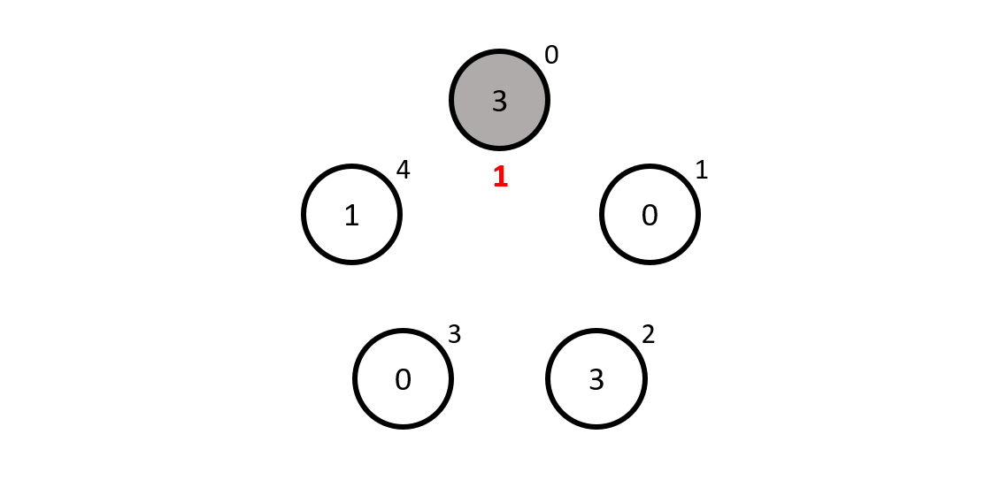
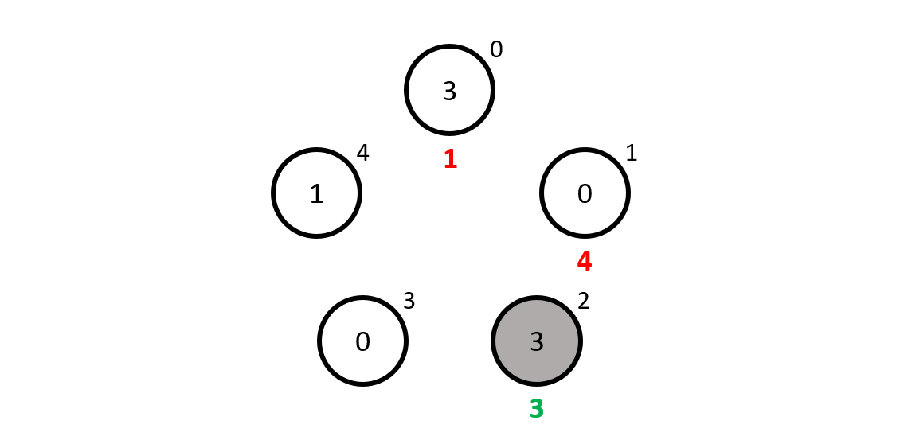
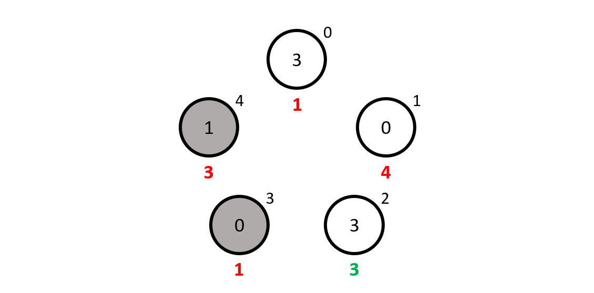

$n$ mathematicians with numbered party hats gather around in a circle... It is a matter of life or death!

===


### Foreword

I was challenged to solve this problem by Roger Hui, who wrote about it in an article[[1]][roger-article] a couple of years ago.

### Problem statement

Assume $n$ mathematicians are in a circle, each mathematician with a hat in its head and facing the other $n-1$ mathematicians. Each hat will be given a number from $0$ to $n-1$ and every mathematician will be able to see the numbers on the hats of all the other mathematicians. Of course no one will be able to see/know its own number. (In case you haven't understood yet, numbers can show up repeated.)

After some time, all mathematicians will write down, at the same time, a guess for the number on their own hat. If there is at least one person guessing it right, everyone lives. If no one guesses correctly, everyone dies!

Your task is to find out what is the strategy that the mathematicians must employ so that they are sure to live through this ordeal. The mathematicians can discuss the strategy before receiving the numbers but after that they must remain silent and won't be able to communicate with each other.

!!! Give it some thought...

### Solution

The answer is really interesting and can be formulated in mathematical terms in a rather simple way; after that I will walk you through what the mathematical formulation means with some doodles I drew.

Let $a_i$ be the number in the hat of the $i$th mathematician and $g_i$ be the guess the $i$th mathematician writes down. Then $g_i$ satisfies the equation

$g_i + \sum_{j \neq i} a_j \equiv i \hspace{0.5cm} \text{mod } n$

What follows from here is that if $k \equiv \sum_i a_i \text{ mod } n$, then the $k$th mathematician will get its guess right and all other mathematicians will fail.

#### Why it works (mathematically)

Let $a_i, g_i$ be as above and let $k = \sum_i a_i \text{ mod } n$. Notice how

$g_k + \sum_{j \neq k} a_j \equiv k \iff g_k \equiv k - \sum_{j \neq k} a_j.$

Of course, we defined $k = \sum_i a_i$ so the above becomes

$g_k = \sum_{j} a_j - \sum_{j \neq k} a_j = a_k \hspace{0.5cm} \text{mod } n,$

hence the $k$th mathematician will guess correctly.

#### Explanation of the solution

Let us take $n = 5$ and number the mathematicians from $0$ to $4$, starting from the top and going in the clockwise direction. The numbers inside the circles represent the numbers in the hats, that I distributed [randomly][xkcd-random].


Now we pretend we are the mathematician number $0$, and so we see the numbers $0$, $3$, $0$ and $1$, which give $4$ when added up. Now, we are the mathematician $0$ so our guess $g_0$ is how much is left to go from $4$ to $0$ which is... $1$, so that is our guess.

 > In case you are not familiar with modular arithmetics, adding and subtracting is just like you are used to, but numbers wrap around the _modulus_ that in this case is $5$. This is like the hours in a day wrapping around $24$!
 > To do additions and subtractions modulo $5$, just look at the small numbers next to the mathematicians and count clockwise when adding, counter-clockwise when subtracting. For example, $3 + 3$ is $1$ because if you start at mathematician $3$ and you count $3$ mathematicians starting from that one, you end up at mathematician $1$.

To recap, mathematician $0$ guessed $1$ because the other mathematicians' hats added up to $4$ and $4 + 1 \equiv 0$ modulo $5$. Unfortunately, the mathematician got it wrong because its hat had a $3$ on it...



Mathematician $1$ sees $3$, $0$, $1$ and $3$, which add up to $3 + 0 + 1 + 3 \equiv 2$ mudulo $5$ and to get to $1$ we must add $4$, so mathematician $1$ guesses $4$, which is also wrong...


Then came mathematician $2$ who sees $0$, $1$, $3$ and $0$, adding up to $4$. Now, to get from $4$ to $2$ modulo $5$ we need to add $3$, which is what our mathematician guesses... and it is correct!



Just for the sake of completeness, can you tell what mathematicians $3$ and $4$ will write down as their guesses..? Hint: none of them will get it right.



#### A piece of code for you to play with

I wrote a small piece of [APL](https://aplwiki.com) code so you can check for yourself which mathematician writes down its number correctly, just follow [this link][tio] and change the numbers in the last line to whatever you like, then hit the arrow on the top to run the code:

```apl
HatSolver ← {
    ⎕IO ← 0  ⍝ IO delenda est
    n ← ≢⍵
    s ← ⍵ - ⍨ +/⍵
    ⍵ = n| s -⍨ ⍳n
}

⎕← HatSolver 3 0 3 0 1
```

I included the example from this blog post in the code, the `3 0 3 0 1` you can see above. The numbers that get printed show a $0$ for every mathematician that fails and shows a $1$ for the mathematician that guesses correctly.

[roger-article]: http://archive.vector.org.uk/art10500850
[xkcd-random]: https://xkcd.com/221/
[tio]: https://tio.run/##SyzI0U2pTMzJT///3yOxJDg/pyy1SOFR2wSFai7OR31TPf3BHAMFhUe9cxWAvJTUnNS8lESF1OISLgUoyAOredS56FHvVi7OYgivd6uCLpBcoaCtDxYGCdgq5NUoFCvogoQf9W7O46rl4gJaAlKPsNwYaBsIG/7/DwA
