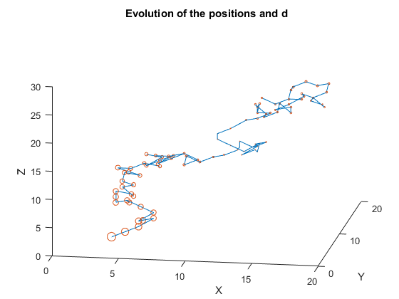
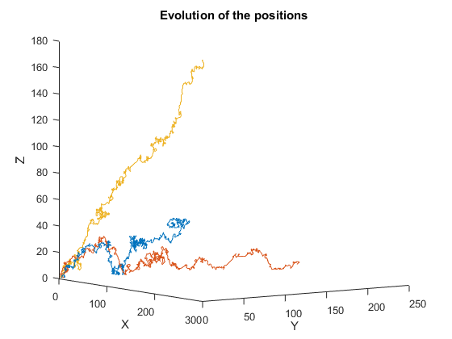

---
metadata:
  description: Neste artigo vou tentar resolver equações diofantinas com passeios
    aleatórios.
title: Resolver equações diofantinas com passeios aleatórios
---

O meu método preferido para resolver equações: tentar coisas aleatórias até que alguma funcione.

===

Passeios aleatórios (vejam o [meu post](../random-walk-simulations) anterior) e equações Diofantinas são dois assuntos matemáticos de grande interesse. Depois de um seminário na faculdade, tentei juntar os dois para fazer algo de interessante e foi isto que inventei: tentar usar um caminho aleatório para encontrar soluções de uma equação Diofantina! [Neste](https://drive.google.com/open?id=0ByBeLS6ciLYVY1dXWVlvY2JSdGM) relatório, tento explanar como decidi fazer isso e como o concretizei com uma implementação em Matlab (disponível [aqui](https://github.com/RojerGS/projects/tree/master/randomWalks/diophantineEqs)) que, em particular, produziu as duas imagens deste post.

Na primeira imagem, a linha a azul representa um caminho aleatório, e os nós a vermelho/laranja representam o quão próximo esses pontos estão de soluções. Na segunda imagem vemos a evolução de três caminhos aleatórios que estão a procurar uma solução de $\frac4n = \frac1x + \frac1y + \frac1z$ com<b> </b>$n = 25$, que é a expressão da conjetura de Erdos-Straus.

