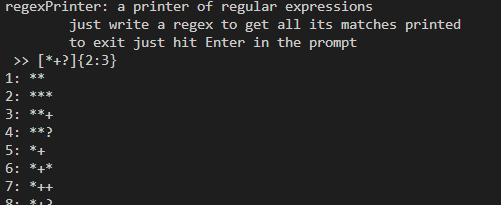

A [regular expression](https://en.wikipedia.org/wiki/Regular_expression), without much rigor, is a very compact way of representing several different strings. Given a regular expression (regex), can I find out all the strings the regex can find?

===

One common use of regular expressions is to look for strings that have a certain structure in a bigger string (say a text). As an example, the regular expression `abc(d|e)` can be used to look for the strings "abcd" and "abce", where the character `|` denotes we have to make a choice (see image above). Thus `cat|dog` would match the strings "cat" and "dog". There are other special symbols that have meanings and purposes.

One very interesting question that arises is: given a regular expression, what are the strings matched by it? To answer that question I wrote a small Python program, that I called `regexPrinter`, that prints all strings matched by a given regular expression! In order to manage that task, I chose a subset of the regex syntax that I wanted to be able to print and also decided that whenever a piece of a pattern was infinite, at a given point the program would just print "..." to denote that infinity. This way, for any regex given, the program always stops.

The `regexPrinter` supports:

 - the `*` operator, that denotes that $0$ or more repetitions are to be matched. For example, `ah*` matches "a", "ah", "ahh", ...;
 - the `+` operator that denotes that $1$ or more repetitions are to be matched. For example, `(hue)+` matches "hue", "huehue", "huehuehue", ...;
 - the `?` operator that denotes either $0$ or $1$ occurrences of the preceding pattern. For example, `woo(hoo)?` matches "woo" and "woohoo";
 - the `{a:b}` operator that matches no less than $a$ and no more than $b$ repetitions of the preceding pattern. As an example, `su{1:3}re` matches the strings "sure", "suure" and "suuure";
 - the `|` operator that denotes a choice. `cat|kat` matches "cat" and "kat" and `thank(s| you)` matches "thanks" and "thank you";
 - the `[]` denote that only one pattern from the ones given are to be matched. For example `[abc]` matches "a", "b" and "c";
 - the parenthesis `()` that are used to group things. One thing to note is that the quantifiers `*+?{:}` all have higher precedence than string concatenation e.g., `ab?` is interpreted as `a(b?)` and _not_ `(ab)?`.

Please bear in mind that any character with no special meaning is interpreted literally, except inside the grouping operator `[]`, where every character is interpreted literally. That is, `[ab*]` matches "a", "b" and "*", while `b&='` will match the string "b&='".

The code for the program can be found [here](https://github.com/RojerGS/projects/blob/master/misc/regexPrinter.py) on GitHub and all it takes is vanilla Python 3 to run. Just run the script and you will be prompted to insert regular expressions. The techniques I used were very, very similar to the ones I used to create [my toy programming language](https://mathspp.com/blog/creating-programming-language-from-scratch), as I saw in [this](https://ruslanspivak.com/lsbasi-part1/) blog series. The way I went about writing this program was by implementing a parser for a subset of the grammar used by regular expressions, generating a tree representation for the regex and then visiting all nodes of the tree, where each node knows how to print itself.

! It is the 24th of July of 2020 and I am migrating this post from my old blog to here, almost 3 years after I originally wrote it. I noticed the program is flawed, for example the program can't handle the regex `[*+?{:}]{2:3}` even though it looks like it should... I challenge you to fix the program! Let me know how it goes :)