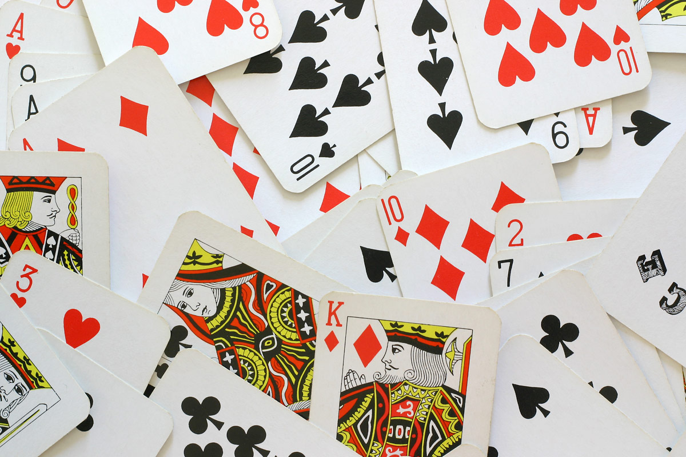

Go grab a deck of cards, a standard $52$ card deck, with $4$ suits and $13$ cards per suit. Just get up and go get it. Now shuffle it.
Shuffle it well without seeing the faces of the cards. When you think you have shuffled enough, you can keep reading.

===

Now that you have shuffled your deck of cards, let me ask you a question:

!!! Which of these two options is most likely?
!!!
!!! - No two equal cards show up together;
!!! - Somewhere in the middle of the deck, two cards of the same value show up together.

Think it through and then check your deck of cards. What happened? Did it have two cards of the same value in a row? If I had to guess, I would say it had!

A perfectly shuffled deck of cards has approximately $95\%$ probability of having two equal cards in a row! [1]
This means that my guess above will be correct $19$ out of every $20$ times.

Is this surprising? For most people, a shuffled deck of cards is a deck that exhibits no patterns, and two equal cards together is an obvious pattern.
This might make them think that a well shuffled deck of cards has no two cards together, when _"shuffled"_ really means _"randomly organized"_.
As it turns out, by randomly rearranging the cards of your deck you are quite likely to get two equal cards together.

### Bonus content

Shuffle your deck of cards again, please. Now what if we wanted to know how likely it is to get three equal cards in a row?
And what about four equal cards in a row?

Once again, give it some thought.

The fact is that almost $12\%$ of the times, three equal cards will show up together. This is still more likely than getting everything well separated. 
On the other hand, you only get four equal cards in a row in less than $0.25\%$ of the times, which is once in every $400$ shuffles.

---

[1] I wrote [a Python script](https://github.com/RojerGS/projects/blob/master/whatAreTheOdds/shuffled_card_deck.py) to estimate this probability,
as the thought of doing this with pen and paper didn't seem very inviting. The script estimates the probability of getting at least two equal in a row as $\approx 95.5\%$ 
and the probability of having everything thoroughly separated as $\approx 4.5\%$.
