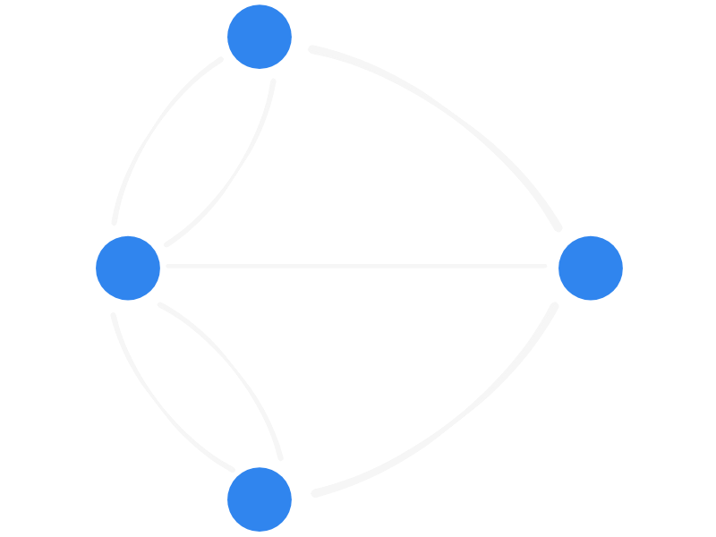

(Try to) solve a series of apparently simple and unrelated puzzles
and uncover the mathematical elegance behind the solutions.

===

# Purpose

The aim of this workshop is to have the audience play around with many deceptively simple puzzles they already know and have them realize that mathematics has a say on everything.

# Content

This workshop is suitable for people of _any_ age and depending on how much time I get, I pick a set of puzzles and then I do the following:

 1. show a simple version of the puzzle that can be solved easily;
 2. have the participants attempt similar puzzles on the board (... with a twist! Some of the puzzles I present at this stage are _not_ solvable);
 3. promote a debate about whether the puzzles are solvable (and the participants are just bad) or not;
 4. use mathematics to prove the puzzles are impossible to solve.

The puzzles I end up picking are usually related to graph theory, but that is just because graphs can easily hide in plain sight. A problem I talk about very often is the problem of the [seven bridges of Königsberg](https://en.wikipedia.org/wiki/Seven_Bridges_of_K%C3%B6nigsberg).

# Past sessions

 - So far I have given this workshop 4 times (in 2019) and I confess it was a huge success among the participants!
